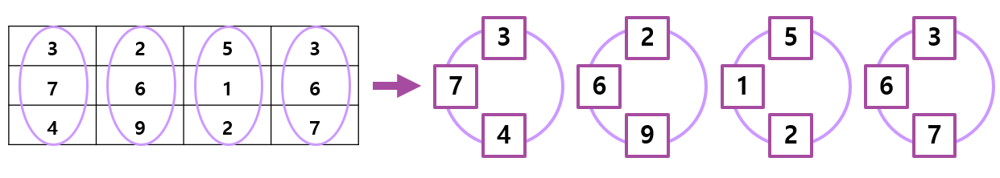

# 2차원 배열의 열을 회전시키기

## 1. 문제

```
1. 3개의 숫자로 된 2차원 배열(3x1)이 있습니다.
ex)
1
2
3

2. 이 배열을 한번 돌리면 아래와 같이 됩니다.
1    3
2 -> 1
3    2

3. 두번 더 돌리게 되면 아래와 같이 됩니다.
3    2    1
1 -> 3 -> 2
2    1    3

4. 이런식으로 열마다 각각 동작하는 2차원 배열(3x4)이 있습니다. (아래의 배열을 하드코딩 해주세요.)
3 2 5 3
7 6 1 6
4 9 2 7

5. 각 열마다 회전 시킬 횟수를 입력받고 최종 회전한 결과 배열을 출력해주세요.
ex)
input)
1 2 1 2

output)
4626
3957
7213
```

- 

## 2. 입력

- 각 열마다 회전 시킬 횟수를 입력받습니다.

## 3. 출력

- 최종 회전한 결과 배열을 출력해주세요.


## 4. 예제 입력
```
1 2 1 2
```

## 5. 예제 출력
```
4626
3957
7213
```

## 6. 코드

```c++
#include <iostream>
using namespace std;

int map[3][4] = {
	3, 2, 5, 3,
	7, 6, 1, 6,
	4, 9, 2, 7
};

int vect[4];

int main() {
	for (int i = 0; i < 4; i++) {
		cin >> vect[i];
	}

	for (int i = 0; i < 4; i++) {
		for (int j = 0; j < vect[i]; j++) {
			int temp = map[2][i];
			map[2][i] = map[1][i];
			map[1][i] = map[0][i];
			map[0][i] = temp;
		}
	}

	for (int i = 0; i < 3; i++) {
		for (int j = 0; j < 4; j++) {
			cout << map[i][j];
		}
		cout << "\n";
	}

	return 0;
}
```
