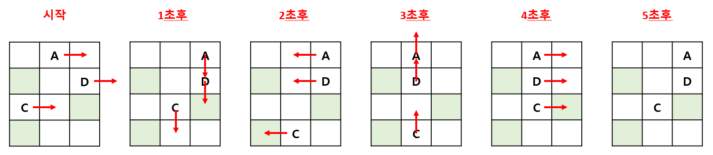

# 움직이는 저글링

## 1. 문제

- 2차원 배열(4x3)로 이루어진 맵을 입력받습니다.
- 맵의 입력값 중에 '#'은 벽을 뜻하고, '_' 이동가능 공간, 알파벳은 저글링의 이름을 뜻합니다.
- 저글링이 움직이는 AI는 단순하여 오른쪽 -> 아래 -> 왼쪽 -> 위 순서로만 움직입니다.

```
- 1초 후: 오른쪽 이동,
- 2초 후: 아래쪽 이동,
- 3초 후: 왼쪽 이동,
- 4초 후: 위쪽 이동
- 5초 후: 다시 오른쪽 이동
```

- 단, 저글링은 벽을 통과하지 못하며, 같은 저글링끼리 겹치지도 못합니다.
- 저글링들의 이동순서는 알파벳 순으로 이동합니다. (A -> Z)
- 맵(4x3)을 입력 받은 후, 5초 후의 상황을 출력해주세요.
- 

## 2. 입력
- 2차원 배열(4x3)로 이루어진 맵을 입력받아 주세요.

## 3. 출력

- 맵(4x3)을 입력 받은 후, 5초 후의 상황을 출력해주세요.


## 4. 예제 입력
```
_A_
#_G
E_#
#__
```

## 5. 예제 출력
```
__A
#_G
_E#
#__
```

## 6. 코드

```c++
#include <iostream>
using namespace std;

char map[4][4];

void left(int y, int x) {
	int dx = x - 1;

	if (dx >= 0 && map[y][dx] == '_') {
		map[y][dx] = map[y][x];
		map[y][x] = '_';
	}
}

void right(int y, int x) {
	int dx = x + 1;

	if (dx < 3 && map[y][dx] == '_') {
		map[y][dx] = map[y][x];
		map[y][x] = '_';
	}
}

void up(int y, int x) {
	int dy = y - 1;

	if (dy >= 0 && map[dy][x] == '_') {
		map[dy][x] = map[y][x];
		map[y][x] = '_';
	}
}

void down(int y, int x) {
	int dy = y + 1;

	if (dy < 4 && map[dy][x] == '_') {
		map[dy][x] = map[y][x];
		map[y][x] = '_';
	}
}

int main() {
	char alpha[4] = "ACD";

	for (int i = 0; i < 4; i++) {
		for (int j = 0; j < 3; j++) {
			cin >> map[i][j];
		}
	}

	for (int i = 0; i < 5; i++) {
		for (int j = 0; j < 3; j++) {
			for (int k = 0; k < 4; k++) {
				for (int l = 0; l < 3; l++) {
					if (alpha[j] == map[k][l]) {
						if (i == 0 || i == 4) right(k, l);
						else if (i == 1) down(k, l);
						else if (i == 2) left(k, l);
						else up(k, l);
					}
				}
			}
		}
	}

	for (int i = 0; i < 4; i++) {
		cout << map[i] << "\n";
	}

	return 0;
}
```
