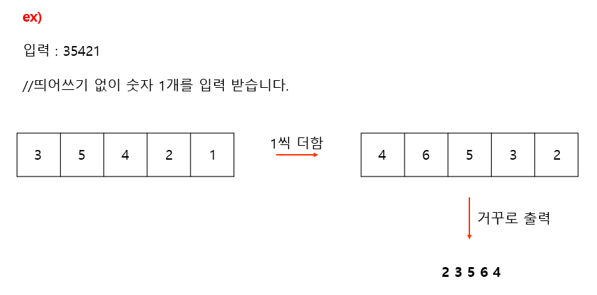

# 내 마음대로 숫자 바꾸기 #

## 1. 문제
- 5자리의 숫자를 입력받고, 각 각의 자리마다 1을 더합니다. (만약 1을 더하였을 때 해당 자리의 숫자가 10이되면 자리올림을 하여야합니다.)
- 최종 완성된 숫자를 거꾸로 출력해주세요.
- 

## 2. 입력
- 5자리의 숫자를 입력받습니다.

## 3. 출력
- 최종 완성된 숫자를 거꾸로 출력해주세요.

## 4. 예제 입력
```
12345
```

## 5. 예제 출력
```
65432
```

## 6. 코드
```c++
#include <iostream>
using namespace std;

int main()
{
    int n;
    int arr[5];
    cin >> n;

    for (int i = 4; i >= 0; i--) {
        n += 1;
        arr[i] = n % 10;
        n = n / 10;
    }
    
    for (int i = 4; i >= 0; i--) {
        cout << arr[i];
    }

    return 0;
}
```
