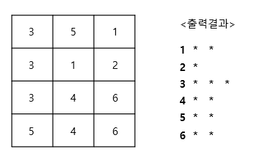

# 빈도수 출력하기 #

## 1. 문제
- 1에서 6사이의 숫자로 구성된 아래의 2차원 배열(4x3(을 하드코딩 해주세요.

```
3 5 1
3 1 2
3 4 6
5 4 6
```

- 1 ~ 6까지의 숫자가 몇 개가 있는지 아래의 그림처럼 나타내주세요.



## 2. 출력
- 1 ~ 6까지의 숫자가 몇 개가 있는지 위의 예제처럼 나타내주세요.

## 3. 예제 출력
```
1 * *
2 *
3 * * *
4 * *
5 * *
6 * *
```

## 4. 코드

```c++
#include <iostream>
using namespace std;

int map[4][3] = {
    3, 5, 1,
    3, 1, 2,
    3, 4, 6,
    5, 4, 6
};

int main()
{
    int check[10] = { 0 };
    for (int i = 0; i < 4; i++) {
        for (int j = 0; j < 3; j++) {
            check[map[i][j]]++;
        }
    }

    for (int i = 0; i < 10; i++) {
        if (check[i] > 0) {
            cout << i << " ";
            for (int j = 0; j < check[i]; j++) cout << "* ";
            cout << "\n";
        }
    }

    return 0;
}
```
