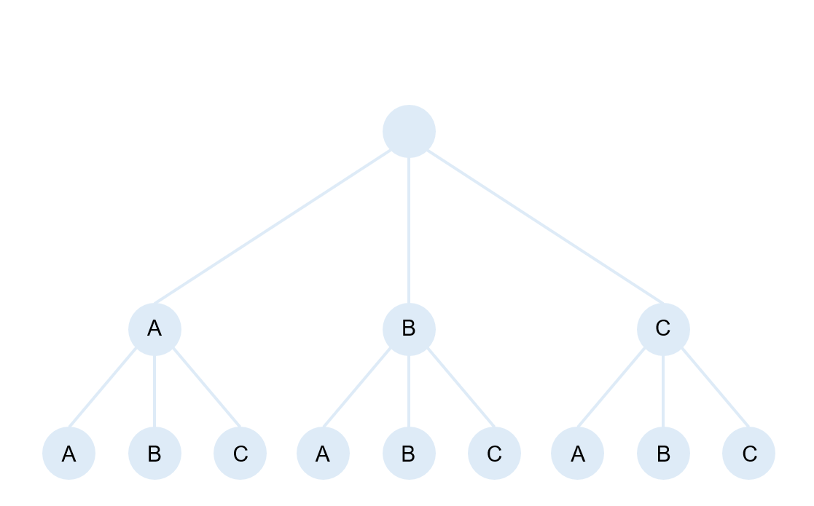

# 트리 탐색하기 #

## 1. 문제


- Level 2에 도달했을 때, Path를 출력해주세요.

## 2. 출력
- Level 2에 도달했을 때, Path를 출력해주세요.

## 3. 예제 출력
```
AA
AB
AC
BA
BB
BC
CA
CB
CC
```

## 4. 코드

```c++
#include <iostream>
using namespace std;

char str[3];

void path(int x) {
    if (x == 2)
    {
        cout << str << "\n";
        return;
    }

    for (int i = 0; i < 3; i++)
    {
        str[x] = 'A' + i;
        path(x + 1);
    }
}

int main()
{
    str[2] = '\0';
    path(0);
}
```
