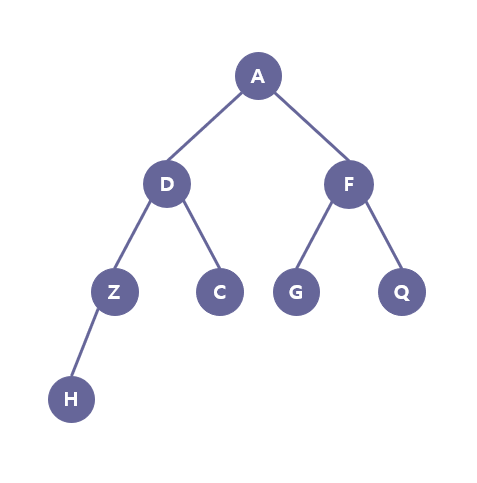

# Tree 02 #

## 1. 문제
- 아래 그림에 있는 이진 트리를 1차원 배열에 저장해주세요.
- 
- 문자 2개를 입력받고, 해당하는 노드가 부모자식 관계인지 판별하는 프로그램을 작성하시오.

## 2. 입력
- 문자 2개를 입력받는다.

## 3. 출력
- 부모자식 관계라면 "부모자식관계"를 출력하고 아니라면 "아님"을 출력해주세요.

## 4. 예제 입력
```
D F
```

## 5. 예제 출력
```
아님
```

## 6. 예제 입력

```
Z D
```

## 7. 예제 출력

```
부모자식관계
```

## 8. 코드

```c++
#include <iostream>
using namespace std;

int map[8][8] = {
	0, 1, 1, 0, 0, 0, 0, 0,
	0, 0, 0, 1, 1, 0, 0, 0,
	0, 0, 0, 0, 0, 1, 1, 0,
	0, 0, 0, 0, 0, 0, 0, 1,
};

char names[9] = "ADFZCGQH";

int main() {
	char n, m;
	int lx, rx;
	
	cin >> n >> m;

	for (int i = 0; i < 8; i++) {
		if (n == names[i]) lx = i;
		if (m == names[i]) rx = i;
	}

	if (map[lx][rx] == 1 || map[rx][lx] == 1) cout << "부모자식관계";
	else cout << "아님";

	return 0;
}
```
