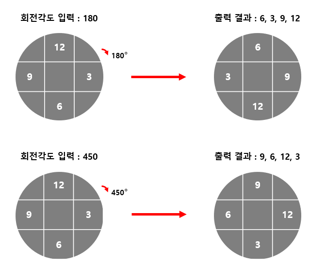

# 2차원 배열 시계 방향으로 회전시키기

## 1. 문제
- 2차원 배열(3x3)이 있습니다.
- 이 배열을 90도의 배수로 입력을 받아 시계방향으로 회전시키고 결과를 출력해주세요.
- 

## 2. 입력
- 배열을 회전시킬 90도의 배수로 입력을 받는다.

## 3. 출력
- 최종 결과를 출력한다.

## 4. 예제 입력
```
180
```

## 5. 예제 출력
```
6 3 9 12
```

## 6. 코드
```c++
#include <iostream>
using namespace std;

int map[3][3] = {
    0, 12, 0,
    9, 0, 3,
    0, 6, 0
};

int direct[4][2] = {
    1, 1,
    -1, 1,
    1, -1,
    -1, -1
};

void spin() {
    int temp[4][4] = { 0 };
    int cnt = 0;
  
    for (int i = 0; i < 3; i++) {
        for (int j = 0; j < 3; j++) {
            if (map[i][j] > 0) {
                int dy = i + direct[cnt][0];
                int dx = j + direct[cnt++][1];

                temp[dy][dx] = map[i][j];
            }
        }
    }

    for (int i = 0; i < 3; i++) {
        for (int j = 0; j < 3; j++) {
            map[i][j] = temp[i][j];
        }
    }
}

int main()
{
    int n;
    cin >> n;

    int x = n / 90;

    for (int i = 0; i < x; i++) {
        spin();
    }

    for (int i = 0; i < 3; i++) {
        for (int j = 0; j < 3; j++) {
            if (map[i][j] > 0) cout << map[i][j] << " ";
        }
    }

    return 0;
}
```
