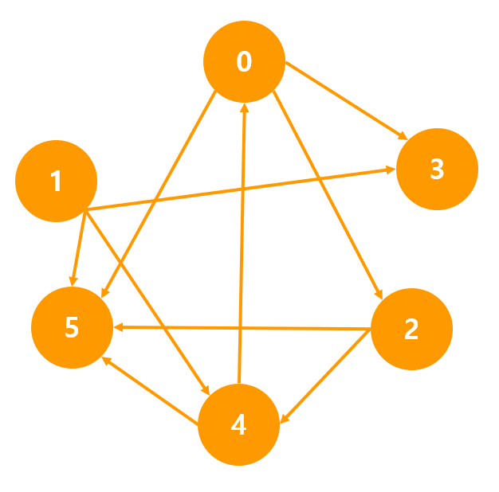

# DFS - 인접행렬 Graph

## 1. 문제
- 인접행렬 Graph를 DFS로 탐색합니다.
- 아래의 인접행렬(6x6)을 하드코딩해주세요.

```c++
int graph[6][6] = {
    0, 0, 1, 1, 0, 1,
    0, 0, 0, 1, 1, 1,
    0, 0, 0, 0, 1, 1,
    0, 0, 0, 0, 0, 0,
    1, 0, 0, 0, 0, 1,
  	0, 0, 0, 0, 0, 0
};
```

- 그 후에, 출발 노드를 입력받고, 입력 받은 노드부터 탐색을 시작합니다.
- 노드를 방문할때마다 노드 번호를 출력해주세요. 그리고, 여러노드로 갈 수 있다면 작은 숫자를 가진 노드부터 탐색합니다.
- 아래의 그림은 하드코딩한 인정행렬을 Graph로 나타낸 모습입니다.



## 2. 입력
- 출발 노드를 입력받는다.

## 3. 출력
- 노드를 방문할때마다 노드 번호를 출력해주세요.

## 4. 예제 입력
```
0
```

## 5. 예제 출력
```
0 2 4 5 3
```

## 6. 코드
```c++
#include <iostream>
using namespace std;

int map[6][6] = {
    0, 0, 1, 1, 0, 1,
    0, 0, 0, 1, 1, 1,
    0, 0, 0, 0, 1, 1,
    0, 0, 0, 0, 0, 0,
    1, 0, 0, 0, 0, 1,
};

int check[6] = { 0 };

void run(int now) {
    cout << now << " ";

    for (int i = 0; i < 6; i++) {
        if (map[now][i] == 1 && !check[i]) {
            check[i] = 1;
            run(i);
        }
    }
}

int main()
{
    int n;
    cin >> n;

    check[n] = 1;
    run(n);

    return 0;
}
```
