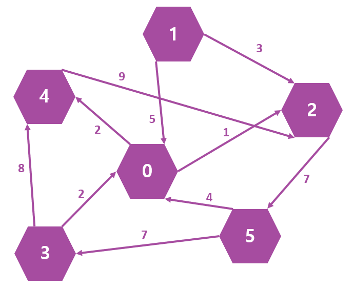

# DFS - 인접행렬 가중치 Graph #

## 1. 문제

- 아래의 인접행렬(6x6)을 하드코딩 해주세요.

```c++
int graph[6][6] = {
    0, 0, 1, 0, 2, 0,
    5, 0, 3, 0, 0, 0,
    0, 0, 0, 0, 0, 7,
    2, 0, 0, 0, 8, 0,
    0, 0, 9, 0, 0, 0,
  	4, 0, 0, 7, 0, 0
};
```

- 각 노드들을 연결하는 선에 가중치 값이 저장되어 있습니다.
- 출발할 노드번호를 입력받고, 출발 지점부터 DFS 탐색하여 각 노드에 도착하였을때, 노드 번호와 누적된 가중치를 출력해주세요.
- 단, 한번 방문한 노드는 방문할 수 없으며 출발지점에서 가중치의 시작 값은 0입니다.
- 한 노드에서 여러노드를 방문 가능할때 작은 숫자부터 탐색합니다.
- 아래의 그림은 위의 인접행렬 Graph입니다.



## 2. 입력

- 출발할 노드번호를 입력받습니다.

## 3. 출력
-  각 노드에 도착하였을때, 노드 번호와 누적된 가중치를 출력해주세요.

## 4. 예제 입력
```
0
```

## 5. 예제 출력
```
0 0
2 1
5 8
3 15
4 23
```

## 6. 코드
```c++
#include <iostream>
using namespace std;

int map[6][6] = {
    0, 0, 1, 0, 2, 0,
    5, 0, 3, 0, 0, 0,
    0, 0, 0, 0, 0, 7,
    2, 0, 0, 0, 8, 0,
    0, 0, 9, 0, 0, 0,
    4, 0, 0, 7, 0, 0
};

int sum = 0, check[6] = { 0 };

void run(int now) {
    cout << now << " " << sum << "\n";

    for (int i = 0; i < 6; i++) {
        if (map[now][i] > 0 && !check[i]) {
            sum += map[now][i];
            check[i] = 1;
            run(i);
        }
    }
}

int main()
{
    int n;
    cin >> n;

    check[n] = 1;
    run(n);

    return 0;
}
```
