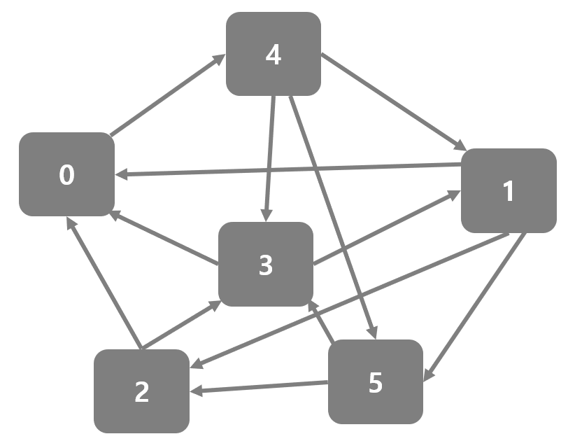

# BFS - 인접행렬 Graph #

## 1. 문제

- 아래의 인접행렬(6x6) Graph를 하드코딩 해주세요.

```c++
int graph[6][6] = {
	0, 0, 0, 0, 1, 0,
	1, 0, 1, 0, 0, 1,
  1, 0, 0, 1, 0, 0,
  1, 1, 0, 0, 0, 0,
  0, 1, 0, 1, 0, 1,
  0, 0, 1, 1, 0, 0
};
```

- 출발 노드를 입력받고, BFS로 탐색하여 각 노드를 방문할 때마다 방문한 노드를 출력하는 프로그램을 작성해주세요.
- 단, 한번 방문한 노드는 다시 방문할 수 없습니다.
- 아래의 그림은 위의 인접행렬을 Graph로 나타낸 모습입니다.
- 

## 2. 입력

- 출발 노드를 입력받아주세요.

## 3. 출력
- 각 노드를 방문할 때마다 방문한 노드를 출력해주세요.

## 4. 예제 입력
```
0
```

## 5. 예제 출력
```
0
4
1
3
5
2
```

## 6. 코드

```c++
#include <iostream>
using namespace std;

int map[6][6] = {
    0, 0, 0, 0, 1, 0,
    1, 0, 1, 0, 0, 1,
    1, 0, 0, 1, 0, 0,
    1, 1, 0, 0, 0, 0,
    0, 1, 0, 1, 0, 1,
    0, 0, 1, 1, 0, 0
};

int main()
{
    int n;
    cin >> n;

    int head = 0, tail = 1, vect[10] = { n, };
    int check[10] = { 0 };
    check[n] = 1;
    while (head != tail) {
        int now = vect[head++];
        cout << now << "\n";
        for (int i = 0; i < 6; i++) {
            if (map[now][i] && !check[i]) {
                check[i] = 1;
                vect[tail++] = i;
            }
        }
    }

    return 0;
}
```
