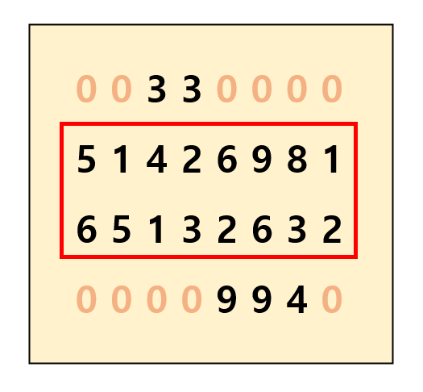

# 사각형 땅따먹기

## 1. 문제
- 4x8 사이즈의 땅을 입력받습니다.
- 입력 받은 땅에서 0을 제외한 숫자를 사각형 모양으로 선택하면 자신의 땅이 됩니다.
- [땅 선택 예제 이미지]



- 사각형 모양의 땅을 선택한 부분의 가치를 합하여 출력하는 프로그램을 작성해주세요.

## 2. 입력

- 4x8 사이즈의 땅을 입력받습니다.

## 3. 출력

- 사각형 모양의 땅을 선택한 부분의 가치를 합하여 출력해주세요.

## 4. 예제 입력

```
0 0 3 3 0 0 0 0
5 1 4 2 6 9 8 1
6 5 1 3 2 6 3 2
0 0 0 0 9 9 4 0
```

## 5. 예제 출력

```
64
```

## 6. 코드

```c++
#include <iostream>
using namespace std;

int map[4][8];

int getValueR(int y, int x) {
    int val = 0, maxX = 7;

    for (int i = y; i < 4; i++) {
        int tVal = 0, tX = -1;
        for (int j = x; j <= maxX; j++) {
            if (map[i][j] == 0) break;
            tX = j;
            tVal += map[i][j];
        }

        if (i == y) maxX = tX;

        if (maxX == tX) val += tVal;
        else return val;
    }
    return val;
}

int getValueD(int y, int x) {
    int val = 0, maxY = 3;

    for (int i = x; i < 8; i++) {
        int tVal = 0, tY = -1;
        for (int j = y; j <= maxY; j++) {
            if (map[j][i] == 0) break;
            tY = j;
            tVal += map[j][i];
        }

        if (i == x) maxY = tY;

        if (maxY == tY) val += tVal;
        else return val;
    }
    return val;
}

int main()
{
    for (int i = 0; i < 4; i++) {
        for (int j = 0; j < 8; j++) {
            cin >> map[i][j];
        }
    }

    int max = -1;
    for (int y = 0; y < 4; y++) {
        for (int x = 0; x < 8; x++) {
            int v = 0;
            if (map[y][x] != 0) {
                v = getValueR(y, x);
                if (v > max) max = v;
                v = getValueD(y, x);
                if (v > max) max = v;
            }
        }
    }

    cout << max;

    return 0;
}
```

