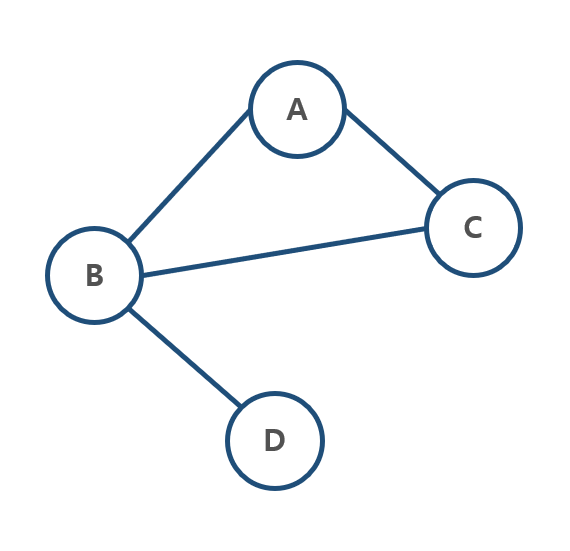

# Cycle 찾기

## 1. 문제

- 노드 4개의 연결상태를 입력 받고, Cycle이 있는 그래프인지 판별해주세요.
- Cycle이 있다면 "발견", 없다면 "미발견"을 출력하는 프로그램을 작성하시오.
- [예제 이미지]



- 위의 이미지는 Cycle이 있으므로 "발견"을 출력합니다.

## 2. 입력

- 첫 줄: 간선의 개 수를 입력 받습니다.
- 다음 줄부터: 연결 정보를 입력받습니다.

## 3. 출력

- Cycle이 있다면 "발견", 없다면 "미발견"을 출력해주세요.

## 4. 입력 예시

```
4
A C
A B
B D
C B
```

## 5. 출력 예시

```
발견
```

## 6. 코드

```c++
#include <iostream>
using namespace std;

int vect[1000] = { 0, };

char getBoss(char ch) {
	if (vect[ch] == 0) return ch;

	int ref = getBoss(vect[ch]);
	vect[ch] = ref;
	return ref;
}

void setGroup(char lv, char rv) {
	char lb = getBoss(lv);
	char rb = getBoss(rv);

	if (lb == rb) return;

	vect[rv] = lb;
}

int main() {

	int n;
	cin >> n;

	int isCycle = 0;
	for (int i = 0; i < n; i++) {
		char c, h;
		cin >> c >> h;

		if (getBoss(c) != getBoss(h)) setGroup(c, h);
		else {
			isCycle = 1;
			break;
		}
	}

	if (isCycle) cout << "발견";
	else cout << "미발견";


	return 0;
}
```
