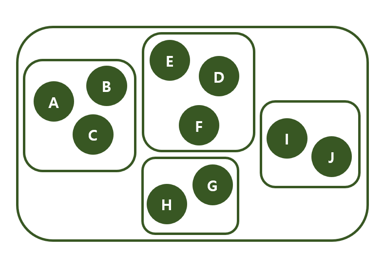

# 남은 그룹

## 1. 문제

- 아래의 이미지와 같이 그룹을 형성하고 있습니다.
- 아래의 이미지는 그룹의 초기 상태를 나타냅니다.
- 아래의 이미지와 같이 그룹이 지어진 상태에서 시작합니다.



- 위의 이미지와 같은 초기 상태에서 시작합니다. 따라서, 입력을 받기 전 남아있는 그룹의 수는 총 4개 입니다.
- 이제 그룹으로 합쳐질 n개의 문자 쌍을 입력 받아주세요. n개의 문자 쌍을 모두 Groupping을 했을 때, 최종적으로 몇 개의 그룹이 남아있는지 출력하는 프로그램을 작성하시오.

```
[Exam]
input)
3
G I // G와 I가 속한 그룹을 합침 (현재 그룹수 : 4 --> 3개)
D E // D와 E가 속한 그룹을 합침, 하지만 이미 같은 그룹이라 그룹의 수는 변동 없음 (현재 그룹 수 : 3개)
H J // D와 E가 속한 그룹을 합침, 하지만 이미 같은 그룹이라 그룹의 수는 변동 없음 (현재 그룹 수 : 3개)

output: 3개
```


## 2. 입력

- 첫 줄: 합칠 그룹의 수를 입력받습니다.
- 다음 줄부터: 합칠 그룹원 두 명을 입력받습니다.

## 3. 출력

- 최종적으로 몇 개의 그룹이 남아있는지 출력해주세요.


## 4. 예제 입력
```
3
G I
D E
H J
```

## 5. 예제 출력
```
3개
```

## 6. 코드

```c++
#include <iostream>
using namespace std;

int vect[100] = { 0 };
char getBoss(char ch) {
	if (vect[ch] == 0) return ch;

	int ret = getBoss(vect[ch]);
	vect[ch] = ret;
	return ret;
}

void setGroup(char lv, char rv) {
	char lb = getBoss(lv);
	char rb = getBoss(rv);

	if (lb == rb) return;
	vect[rv] = lb;
}

int main() {
	setGroup('A', 'B');
	setGroup('B', 'C');
	setGroup('D', 'E');
	setGroup('E', 'F');
	setGroup('G', 'H');
	setGroup('I', 'J');

	int n, g = 4;
	cin >> n;

	for (int i = 0; i < n; i++) {
		char c, h;
		cin >> c >> h;

		if (getBoss(c) != getBoss(h)) {
			setGroup(c, h);
			g--;
		}
	}

	cout << g << "개";

	return 0;
}
```
