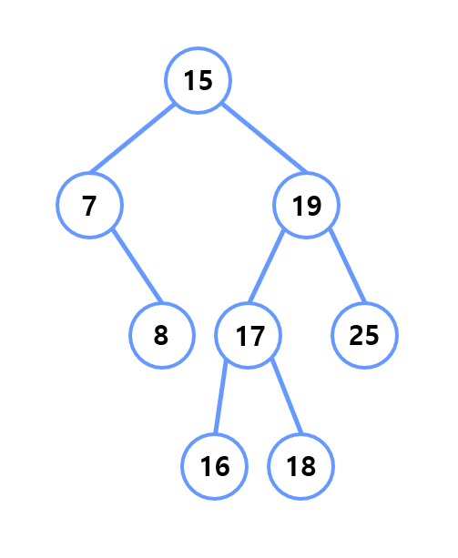
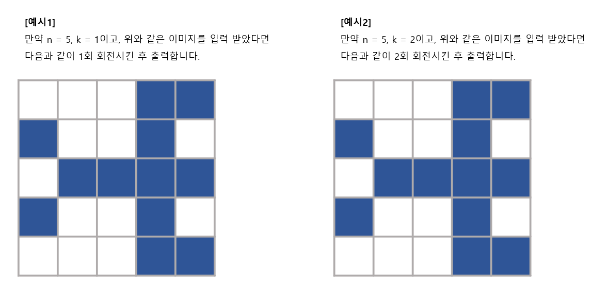

# 인기 많은 알파벳 찾기

## 1. 문제



- 위의 이미지의 그래프에 A ~ D의 관계도가 나타나 있습니다.
- 이것을 인접행렬로 표현하면 아래처럼 표현할 수 있습니다.



- 위의 인접행렬을 보고, 연결 상태를 파악해서 가장 많이 연결된 알파벳을 출력해주세요.


## 2. 입력

- 인접행렬 2차원 배열(4x4)을 입력 받습니다.

## 3. 출력

- 가장 많이 연결된 알파벳을 출력해주세요.


## 4. 예제 입력
```
0 1 1 1
1 0 1 0
1 1 0 0
1 0 0 0
```

## 5. 예제 출력
```
A
```

## 6. 코드

```c++
#include <iostream>
using namespace std;

int map[4][4];

int main() {
	int alpha[4] = { 0 };

	for (int i = 0; i < 4; i++) {
		for (int j = 0; j < 4; j++) {
			cin >> map[i][j];
			if (map[i][j] == 1) alpha[j]++;
		}
	}

	int max = -1, maxIdx;

	for (int i = 0; i < 4; i++) {
		if (max < alpha[i]) {
			maxIdx = i;
			max = alpha[i];
		}
	}

	cout << char(65 + maxIdx);

	return 0;
}
```
