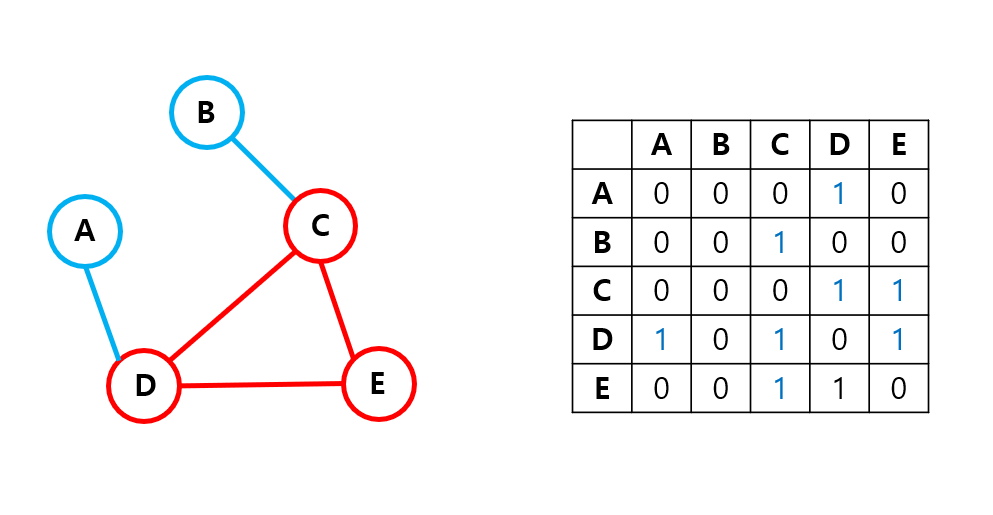

# Cycle 찾기 2

## 1. 문제

- Node의 개 수와 인접행렬을 입력받고, Cycle의 유무를 출력하는 프로그램을 작성하시오.
- [Exam 01]



- 위 이미지의 그래프는 Cycle이 존재합니다. (C-D-E)
- 출력결과: cycle 발견
- [Exam 02]


- 위 이미지의 그래프는 Cycle이 존재하지 않습니다.
- 출력결과: 미발견

## 2. 입력
- 첫 줄: n을 입력 받아주세요.
- 다음 줄부터: n x n 사이즈의 인접행렬을 입력받으세요.

## 3. 출력

- Cycle의 유무를 출력해주세요.


## 4. 예제 입력
```
5
0 0 0 1 0
0 0 1 0 0
0 0 0 1 1
1 0 1 0 1
0 0 1 1 0
```

## 5. 예제 출력
```
cycle 발견
```

## 6. 코드

```c++
#include <iostream>
using namespace std;

int vect[100] = { 0 };
int getBoss(int val) {
	if (vect[val] == 0) return val;

	int v = getBoss(vect[val]);
	vect[val] = v;
	return v;
}

void setGroup(int lv, int rv) {
	int lb = getBoss(lv);
	int rb = getBoss(rv);

	if (lb == rb) return;

	vect[rv] = lb;
}

int main() {
	int n;
	int map[100][100];

	cin >> n;

	for (int i = 0; i < n; i++) {
		for (int j = 0; j < n; j++) {
			cin >> map[i][j];
		}
	}
	

	int cycle = 0;
	for (int i = 0; i < n; i++) {
		for (int j = i; j < n; j++)  {
			if (map[i][j] != 1) continue;
			if (getBoss(i) != getBoss(j)) setGroup(i, j);
			else {
				cycle = 1;
				break;
			}
		}
	}

	if (cycle) cout << "cycle 발견";
	else cout << "미발견";

	return 0;
}
```
