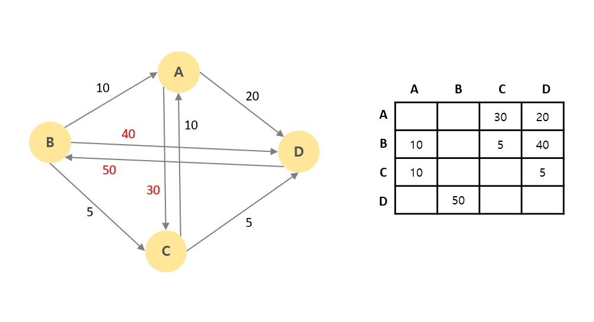

# Heap 인접행렬 #

## 1. 문제

- N과 인정행렬(NxN)을 입력 받고, 가장 가치가 높은 간선 3개를 출력하는 프로그램을 작성하시오.

.

## 2. 입력
- N과 인정행렬(NxN)을 입력 받는다.

## 3. 출력
-  가장 가치가 높은 간선 3개를 출력해주세요.

## 4. 예제 입력
```
4
0 0 30 20
10 0 5 40
10 0 0 5
0 50 0 0
```

## 5. 예제 출력
```
D-B 50
B-D 40
A-C 30
```

## 6. 코드

```c++
#include <iostream>
#include <queue>
using namespace std;

struct Node {
	char from;
	char to;
	int val;
};

bool operator<(Node t1, Node t2) {
	return t2.val > t1.val;
}

priority_queue<Node> q;

int main() {
	int n;
	cin >> n;

	for (int i = 0; i < n; i++) {
		for (int j = 0; j < n; j++) {
			int t;
			cin >> t;

			if (t > 0) {
				Node w = { 'A' + i, 'A' + j, t };
				q.push(w);
			}
		}
	}

	for (int i = 0; i < 3; i++) {
		cout << q.top().from << "-" << q.top().to << " " << q.top().val << "\n";
		q.pop();
	}


	return  0;
}
```
