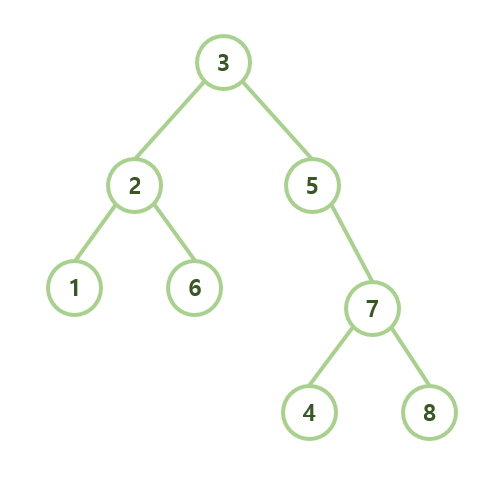

# DFS: 후위 출력

## 1. 문제
- 아래의 이미지에 있는 이진트리를 1차원 배열에 하드코딩 해 주세요.



- DFS를 돌리면서 탐색 순서대로 노드의 값을 출력하고자 합니다.
- 출력하는 타이밍은 아래와 같습니다.
- 왼쪽으로 진입했다가 돌아온 뒤 (왼쪽으로 재귀), 오른쪽으로 진입했다가 돌아왔을 때 (오른쪽으로 재귀) 출력합니다.

## 2. 입력
- 입력 값은 없습니다.

## 3. 출력
- 문제의 조건 대로 탐색하고 출력해주세요.

## 4. 예제 출력
```
1 6 2 4 8 7 5 3
```

## 5. 코드

```c++
#include <iostream>
using namespace std;

int vect[16] = { -1, 3, 2, 5, 1, 6, -1, 7, -1, -1, -1, -1, -1, -1, 4, 8 };

void dfs(int now) {
    if (now > 16) return;
    if (vect[now] == -1) return;

    dfs(now * 2);
    dfs(now * 2 + 1);

    cout << vect[now] << " ";
}

int main()
{
    dfs(1);

    return 0;
}
```

