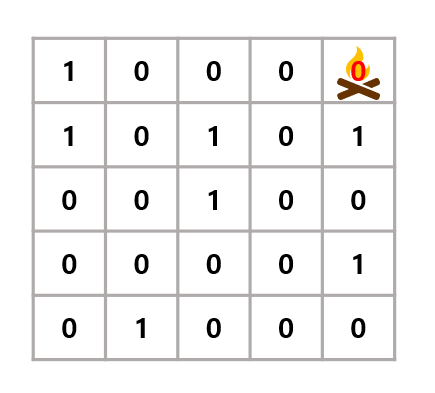
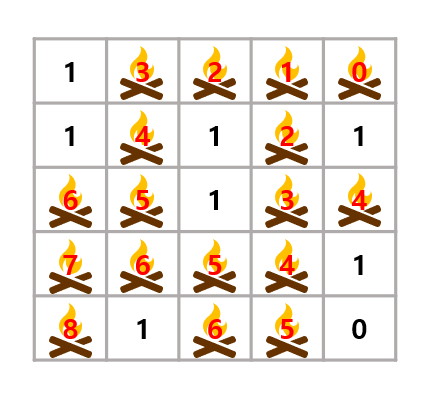

# 바베큐 장작

## 1. 문제
- 2차원 배열의 그릴에 불을 놓을 수 있는 공간은 0, 불을 놓을 수 없는 공간은 1로 입력됩니다. 
- 고기를 맛있게 굽기위해 불을 처음 놓을 좌표를 입력 받으세요.
- 불이 상, 하, 좌, 우로 한 칸씩 늘어날때마다 1초가 경과합니다.
- 불이 모든 자리에 붙었을때의 시간을 출력하세요.



- 2차원 배열에서 (0, 4)에 불을 놓는다면 2차원 배열안의 모든 0에 불이 퍼질때 까지 걸리는 시간은 8초입니다.



## 2. 입력
- 그릴의 세로, 가로 길이 N 을 입력 받습니다. (3 <= n < 1,000)
- 그릴의 정보가 입력 됩니다.
- 그리고 불이 처음 놓일 좌표 Y X 가 입력됩니다.

## 3. 출력
- 모든 '0' 자리에 불이 번지는데 걸리는 시간을 출력하세요.

## 4. 예제 입력
```
5 5
1 0 0 0 0
1 0 1 0 1
0 0 1 0 0 
0 0 0 0 1
0 1 0 0 0 
0 4
```

## 5. 예제 출력
```
8
```

## 6. 코드
```c++
#include <iostream>
#include <vector>
using namespace std;

int n, m, y, x;
vector<vector<int>> arr;
vector<vector<int>> map;

int direct[4][2] = {
    -1, 0,
    1, 0,
    0, -1,
    0, 1
};

void run(int y, int x, int val) {
    for (int i = 0; i < 4; i++) {
        int dy = y + direct[i][0];
        int dx = x + direct[i][1];

        if (dy >= 0 && dx >= 0 && dy < n && dx < m && arr[dy][dx] != 1) {
            int vx = val + 1;
            if (map[dy][dx] == 0 || vx < map[dy][dx]) {
                map[dy][dx] = vx;
                run(dy, dx, val + 1);
            }
        }
    }
}

int main()
{
    cin >> n >> m;

    for (int i = 0; i < n; i++) {
        vector<int> t, v;
        for (int j = 0; j < m; j++) {
            int num;
            cin >> num;

            t.push_back(num);
            v.push_back(0);
        }
        arr.push_back(t);
        map.push_back(v);
    }

    cin >> y >> x;

    map[y][x] = -1;

    run(y, x, 0);

    int max = -21e8;
    for (int i = 0; i < n; i++) {
        for (int j = 0; j < m; j++) {
            if (max < map[i][j]) max = map[i][j];
        }
    }

    cout << max;

    return 0;
}
```
