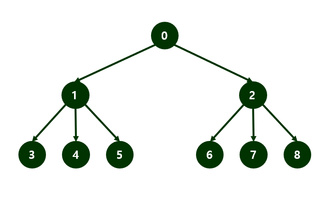

# Tree 3 #

## 1. 문제
- 인접행렬(NxN) 트리를 입력받고, Level 2에 도착할 때 경로를 출력해주세요.



- 만약, 위의 그림에 있는 트리를 인접행렬로 입력 받았다면, 다음과 같이 출력해주세요.

```
0 1 3
0 1 4
0 1 5
0 2 6
0 2 7
0 2 8
```

## 2. 입력
- 첫 줄: N을 입력받는다.
- 다음 줄부터: 인접행렬(NxN)을 입력받는다.

## 3. 출력
- Level 2에 도착할 때 경로를 출력해주세요.

## 4. 예제 입력
```
9
0 1 1 0 0 0 0 0 0
0 0 0 1 1 1 0 0 0
0 0 0 0 0 0 1 1 1
0 0 0 0 0 0 0 0 0
0 0 0 0 0 0 0 0 0
0 0 0 0 0 0 0 0 0
0 0 0 0 0 0 0 0 0
0 0 0 0 0 0 0 0 0
0 0 0 0 0 0 0 0 0
```

## 5. 예제 출력
```
0 1 3
0 1 4
0 1 5
0 2 6
0 2 7
0 2 8
```

## 6. 코드
```c++
#include <iostream>
using namespace std;

int n;
int map[100][100];
char path[100];

void run(int level, int row) {
    if (level == 2) {
        for (int i = 0; i < 3; i++) {
            cout << path[i] << " ";
        }
        cout << "\n";
    }

    for (int i = 0; i < n; i++) {
        if (map[row][i] == 1) {
            path[level + 1] = '0' + i;
            run(level + 1, i);
            path[level + 1] = 0;
        }
    }
}

int main()
{
    cin >> n;

    for (int i = 0; i < n; i++) {
        for (int j = 0; j < n; j++) {
            cin >> map[i][j];
        }
    }

    path[0] = '0';
    run(0, 0);

    return 0;
}
```
