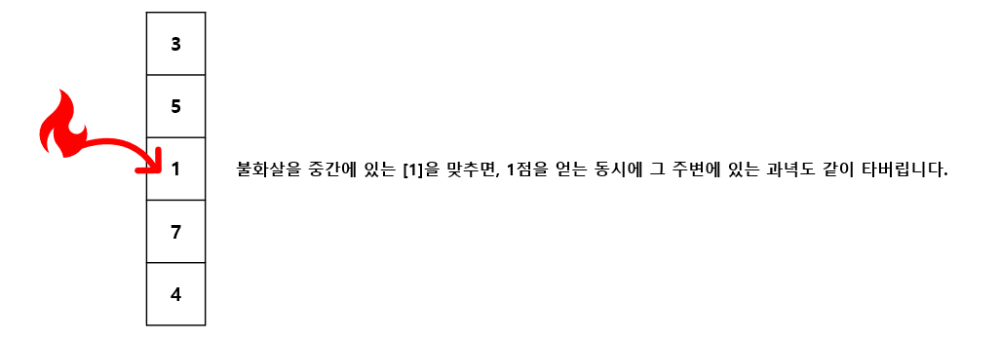
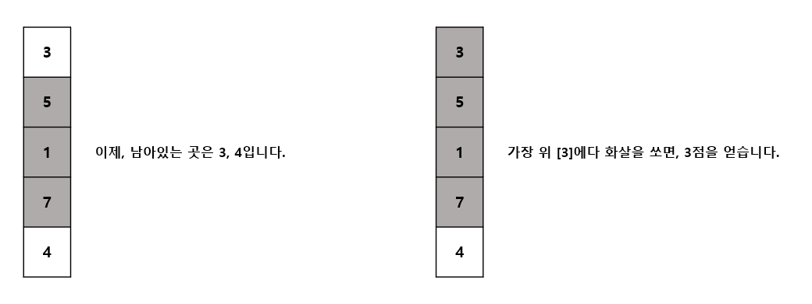

# 불 화살 맞추기 #

## 1. 문제
- 과녁판에 불화살을 쏘아서 얻을 수 있는 최대 점수를 구하려합니다.
- 일직선 과녁판에는 점수들이 적혀있습니다.

- 불화살이 과녁에 맞으면 해당 지점의 점수를 획득 하지만, 해당 지점의 위아래 한칸씩 불이 붙어 태워집니다.
- 불화살을 적절하게 쏘아서 얻을 수 있는 가장 큰 합계 점수를 구해주세요.

> - **예시**
> - 3 5 1 7 4를 입력 받았다면 과녁판의 위에서 부터 순차적으로 점수가 매겨집니다.
>
> 
>
> 
>
> - 마지막 남은칸인 4점에 쏘면 더이상 쏠 곳이 없습니다.
> - 최종적으로 얻을 수 있는 점수는 1+3+4=8 점입니다.
> - 위 예시와 달리,  최고의 점수를 얻는 방법은 [5]와 [7]을 쏘는 방법이며, 총 12점을 획들할수 있습니다.
> - 얻을 수 있는 최고의 점수를 찾아, 출력해 주세요.

## 2. 입력
- 과녁판의 크기 n 을 입력 받습니다. (3 <= n <= 8)
- n개의 점수를 입력 받으세요.

## 3. 출력
- 최대점수를 얻기 위해 맞춘 점수와 그 점수의 합계를 출력 하세요.
- 출력순서는 위에서부터 아래 방향으로 쏜 곳을 차례로 출력해주시면 됩니다.

## 4. 예제 입력
```
5
3 5 1 7 4
```

## 5. 예제 출력
```
5+7=12
```

## 6. 코드

```c++
#include <iostream>
#include <cstring>
#include <algorithm>
#include <vector>
using namespace std;

int vect[5];
int direct[2] = { -1, 1 };
int path[5];
int maxPath[5];
int maxi = -21e8, idx;

void run(int level, int sum) {
    if (maxi < sum) {
        maxi = sum;
        idx = level;
        memcpy(maxPath, path, sizeof(path));
    }

    for (int i = 0; i < 5; i++) {
        if (vect[i] == -1) continue;

        int t = -1, w = -1, v = vect[i];
        int dx1 = i + direct[0];
        int dx2 = i + direct[1];

        if (dx1 >= 0) {
            t = vect[dx1];
            vect[dx1] = -1;
        }

        if (dx2 < 5) {
            w = vect[dx2];
            vect[dx2] = -1;
        }

        vect[i] = -1;

        path[level] = i;
        run(level + 1, sum + v);
        path[level] = 0;
        
        vect[i] = v;
        if (t != -1) vect[dx1] = t;
        if (w != -1) vect[dx2] = w;
    }
}


int main()
{
    for (int i = 0; i < 5; i++) cin >> vect[i];

    run(0, 0);

    for (int i = 0; i < idx; i++) {
        if (i == idx - 1) cout << vect[maxPath[i]] << "=" << maxi;
        else cout << vect[maxPath[i]] << "+";
    }

    return 0;
}
```
