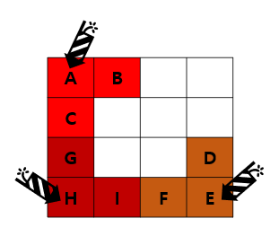

# 폭탄 투하

## 1. 문제
- 맵 중 적군이 있는 곳에 폭탄을 투하하려고 합니다.
- 폭탄을 맵 (2,2)에 투하하면 폭발 범위가 아래처럼 총 5칸에서 폭발합니다.
- 4x4 맵에 알파벳 적군들이 포진해 있습니다.
- 폭탄 N개를 최대한 적합한 곳에 터트리고자 합니다.
- 폭탄을 어느 곳에 투하해야 가장 많은 적군에게 피해를 줄수 있을지 알려주는 프로그램을 작성 해 주세요.
- **세부조건**
  1. 폭탄은 알파벳이 있는 좌표에만 떨어뜨릴 수 있습니다.
  2. 출력할 적의 이니셜은 사전식 순서대로 출력해 주세요.
- **예시**



- 폭탄 3개를 투여할 경우, 정답은 A E H (알파벳 순서대로 출력)

## 2. 입력
- 적군이 위치한 맵의 정보를 입력 받습니다.
- 적은 알파벳으로 입력되고, 빈 공간은 _ 로 입력 됩니다.
- 다음 줄에는 투여할 폭탄의 개수 N을 입력받습니다. (1 <= N <= 5)

## 3. 출력
- 사전순으로 떨어뜨릴 위치의 적군 알파벳을 출력 해주세요.

## 4. 예제 입력
```
AB__
C___
G__D
HIFE
3
```

## 5. 예제 출력
```
A E H
```

## 6. 코드

```c++
#include <iostream>
#include <algorithm>
#include <cstring>
using namespace std;

char map[4][5];
int used[4][4] = { 0 };
int maxi = -21e8;

int direct[5][2] = {
    -1, 0,
    0, 0,
    1, 0,
    0, -1,
    0, 1
};

char maxPath[4];
char path[4];

void run(int level, int sum) {
    if (level == 3) {
        if (maxi < sum) {
            memcpy(maxPath, path, sizeof(path));
            maxi = sum;
        }
        return;
    }
    
    for (int i = 0; i < 4; i++) {
        for (int j = 0; j < 4; j++) {
            if (map[i][j] == '_') continue;
            if (used[i][j]) continue;
            int cnt = 0;
            for (int t = 0; t < 5; t++) {
                int dy = i + direct[t][0];
                int dx = j + direct[t][1];

                if (dy < 0 || dx < 0 || dy >= 4 || dx >= 4) continue;
                if (map[dy][dx] == '_') continue;
                if (used[dy][dx] == 0) cnt++;
                used[dy][dx]++;
            }

            path[level] = map[i][j];
            run(level + 1, sum + cnt);
            path[level] = 0;

            for (int t = 0; t < 5; t++) {
                int dy = i + direct[t][0];
                int dx = j + direct[t][1];

                if (dy < 0 || dx < 0 || dy >= 4 || dx >= 4) continue;
                if (map[dy][dx] == '_') continue;
                used[dy][dx]--;
            }
        }
    }
}

int main()
{
    for (int i = 0; i < 4; i++) {
        for (int j = 0; j < 4; j++) {
            cin >> map[i][j];
        }
    }

    run(0, 0);
    
    sort(maxPath, maxPath + 3);
    for (int i = 0; i < 3; i++) cout << maxPath[i] << " ";

    return 0;
}
```
