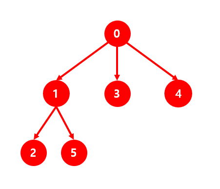

# BFS #

## 1. 문제
- 6개의 Node로 구성된 인접행렬을 입력받습니다.
- 0번 Node부터 BFS로 탐색하여, 홀수 Node를 찾을 때 마다 출력해주세요.
- 만약, 아래의 그림과 같이 트리를 입력받았다면,
- 
- 출력결과: 1 3 5

## 2. 입력
- 6개의 Node로 구성된 인접행렬을 입력받습니다.

## 3. 출력
- 0번 Node부터 BFS로 탐색하여, 홀수 Node를 찾을 때 마다 출력해주세요.

## 4. 예제 입력
```
0 1 0 1 1 0
0 0 1 0 0 1
0 0 0 0 0 0
0 0 0 0 0 0
0 0 0 0 0 0
0 0 0 0 0 0
```

## 5. 예제 출력
```
1 3 5
```

## 6. 코드

```c++
#include <iostream>
using namespace std;

int map[6][6];
int vect[6];

int main()
{
    for (int i = 0; i < 6; i++) {
        for (int j = 0; j < 6; j++) {
            cin >> map[i][j];
        }
    }

    int head = 0;
    int tail = 1;

    while(head != tail) {
        for (int i = 0; i < 6; i++) {
            if (map[head][i] == 1) vect[tail++] = i;
        }
        head++;
    }

    for (int i = 0; i < head; i++) {
        if (vect[i] % 2 == 1) cout << vect[i] << " ";
    }

    return 0;
}
```
