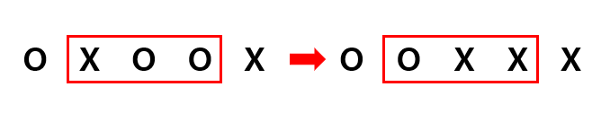
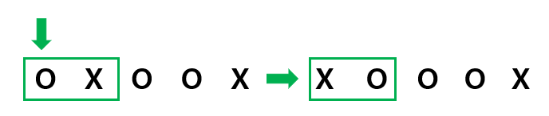

# 고기 뒤집기 #

## 1. 문제
- 시어머니와 며느리는 명절을 맞아 고기를 굽고 있습니다.
- 고기를 뒤집어 모든 같은 방향이 나올때, 가장 적은 뒤집기 횟수를 구해주세요.
- 고기의 상태를 입력 받습니다. O는 앞면, X는 뒷면 입니다.
- 시어머니가 고기를 뒤집을 곳을 지목합니다.
- 며느리는 시어머니가 지목한 곳과 양쪽 좌우를 모두 뒤집습니다.
- 아래 예제는 총 두번만에 고기를 모두 같은 방향으로 고기를 뒤집을 수 있습니다.



- 만약 시어머니가 가장자리를 선택했다면, 며느리는 2개의 고기만 뒤집습니다.




## 2. 입력
- 고기의 방향이 입력 됩니다. 
- O는 앞면, X는 뒷면으로 두 종류의 입력으로 구성되어 있습니다.
- 고기의 개수는 최대 20개 까지 될 수 있습니다.

## 3. 출력
- 모두 같은 방향 (전체 OOOO... 또는 전체 XXXX...) 으로 나오도록 고기를 뒤집을때 가장 적게 뒤집은 수를 출력해주세요.
- 만약 4회 만에 뒤집는 것을 실패한다면 **impossible** 이라고 출력 해 주세요.

## 4. 예제 입력
```
OXOOX
```

## 5. 예제 출력
```
2
```

## 6. 코드

```c++
#include <iostream>
#include <string>
using namespace std;

string s, x, o;
int flag = 0;
int mini = 21e8;

char rev(char ch) {
	if (ch == 'O') return 'X';
	else return 'O';
}

void run(int level, string meat) {
	if (x == meat || o == meat) {
		if (level < mini) mini = level;
		return;
	}

	if (level == 4) {
		return;
	}

	for (int i = 0; i < meat.size(); i++) {
		string t = meat;
		if (i - 1 >= 0) t[i - 1] = rev(t[i - 1]);
		if (i + 1 < meat.size()) t[i + 1] = rev(t[i + 1]);
		t[i] = rev(t[i]);

		run(level + 1, t);
	}
}

int main() {
	cin >> s;

	for (int i = 0; i < s.length(); i++) {
		x += 'X';
		o += 'O';
	}

	run(0, s);
	if (mini < 0) cout << "impossible";
	else cout << mini;

	return 0;
}
```
