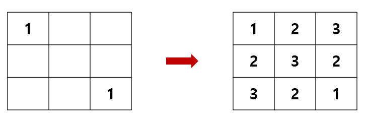
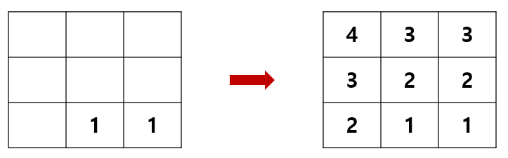

# Virus #

## 1. 문제
- N x N 피부에 바이러스를 투여하려고 합니다.
- 바이러스는 두 곳에 투여되며, 상, 하, 좌, 우 네 방향으로 퍼지게 됩니다.
- 바이러스는 투여되자마자 1 부터 시작하며, 한 칸씩 퍼질때 마다 1씩 증가합니다.
- 바이러스의 최대 수치는 9 입니다.
- 바이러스가 모두 퍼지고 난 뒤 모습을 출력해 주세요.

- **예시 1**

>- 3 x 3 맵에서 (0, 0) 과 (2, 2) 에 바이러스를 투여했을 경우입니다.
>- 아래처럼 바이러스는 상하좌우 네 방향으로 퍼지며, 강도는 1씩 증가합니다.
>- (0, 0) 과 (2, 2) 에서 바이러스가 모두 퍼지면 위와 같은 결과가 출력되어야 합니다.
>
>

- **예시 2**

> - 3 x 3 맵에서 (2, 1) (2, 2)에 바이러스를 투여했을 경우, 최종 결과는 다음과 같습니다.
>
> 

## 2. 입력
- 첫 번째 줄에는 맵의 크기인 N 이 입력됩니다. ( 3 <= N <= 100)
- 다음 줄에는 바이러스가 투여되는 좌표 (Y, X) 두 곳이 입력됩니다.

## 3. 출력
- 바이러스가 모두 퍼지고 난 뒤의 상태를 출력해주세요.

## 4. 예제 입력
```
3
0 0 2 2
```

## 5. 예제 출력
```
123
232
321
```

## 6. 코드
```c++
#include<iostream>
using namespace std;

struct Node {
	int y, x;
};

Node vect[20];
int head, tail = 2;
int direct[4][2] = { -1, 0, 1, 0, 0, -1, 0, 1 };
int map[3][3] = {
	0, 0, 0,
	0, 0, 0,
	0, 0, 0
};

int main() {
	int sy, sx, ey, ex;
	cin >> sy >> sx;
	cin >> ey >> ex;

	map[sy][sx] = 1;
	map[ey][ex] = 1;

	vect[0] = { sy, sx };
	vect[1] = { ey, ex };

	while (head != tail) {
		Node now = vect[head++];

		for (int t = 0; t < 4; t++) {
			int dy = now.y + direct[t][0];
			int dx = now.x + direct[t][1];

			if (dx >= 0 && dy >= 0 && dx < 3 && dy < 3 && map[dy][dx] == 0) {
				map[dy][dx] = map[now.y][now.x] + 1;
				vect[tail++] = { dy, dx };
			}
		}
	}

	for (int i = 0; i < 3; i++) {
		for (int j = 0; j < 3; j++) cout << map[i][j];
		cout << "\n";
	}

	return 0;
}
```
