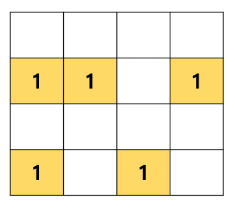
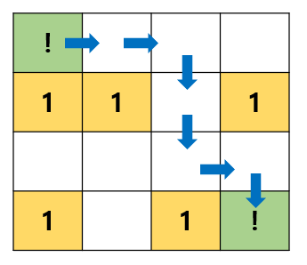

# 미로찾기 with BFS

## 1. 문제
- 시작 좌표에서 종료 좌표까지 최소 몇 회만에 갈 수 있는지 확인해주세요.
- BFS 알고리즘을 사용하여 길을 찾아주세요.
- 아래 1의 위치로는 이동할 수 없습니다. 
- 2차원 배열의 맵은 하드코딩하여 풀어 주세요.



- **예시 1**
- 시작 좌표 (0, 0) 과 도착 좌표 (3, 3) 이 입력 될때, 결과는 6회입니다.



## 2. 입력
- 시작 좌표 Y X 와, 그 다음 줄에 종료 좌표 Y X 를 입력하세요.

## 3. 출력
- 시작 좌표 부터 종료 좌표까지 최소 몇번 만에 도착할 수 있는지 출력해주세요.

## 4. 예제 입력
```
0 0
3 3
```

## 5. 예제 출력
```
6회
```

## 6. 코드
```c++
#include<iostream>
using namespace std;

struct Node {
	int y, x;
	int level;
};

Node vect[20];

int visited[4][4] = { 0 };
int map[4][4] = {
	0, 0, 0, 0,
	1, 1, 0, 1,
	0, 0, 0, 0,
	1, 0, 1, 0
};

int bfs() {
	int head = 0, tail = 1;
	int direct[4][2] = { -1, 0, 1, 0, 0, -1, 0, 1 };

	int sy, sx, ey, ex;

	cin >> sy >> sx;
	cin >> ey >> ex;

	visited[sy][sx] = 1;
	vect[0] = { sy, sx, 0 };

	while (head != tail) {
		Node now = vect[head++];

		for (int i = 0; i < 4; i++) {
			int dy = now.y + direct[i][0];
			int dx = now.x + direct[i][1];

			if (dy >= 0 && dx >= 0 && dy < 4 && dx < 4 && !map[dy][dx] && !visited[dy][dx]) {
				if (dy == ey && dx == ex) return now.level + 1;
				visited[dy][dx] = 1;
				vect[tail++] = { dy, dx, now.level + 1 };
			}
		}
	}
}

int main() {
	cout << bfs() << "회";

	return 0;
}
```
