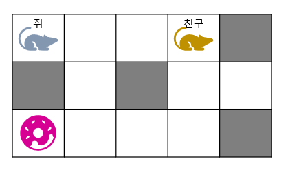

# 친구보러 가는 길

## 1. 문제


- (0, 0)에 서있는 쥐는 **치즈를 먼저 먹고,** 친구를 만나러 가려고 합니다.
- 쥐는 **↑↓ ← →** 로 이동 할 수 있습니다.
- **예시**

> - 위 예제에서는 **9회** 이동으로 치즈를 먹고 친구를 만날 수 있습니다.


## 2. 입력
- 치즈 위치 (Y, X) 와 친구 좌표 (N, M) 을 입력 받으세요.

## 3. 출력
- 친구를 만나기까지의 최단 거리를 출력 해주세요.
- 한 칸을 이동했을때가 1입니다.

## 4. 예제 입력
```
2 0
0 3
```

## 5. 예제 출력
```
9
```

## 6. 코드
```c++
#include<iostream>
using namespace std;

struct Node {
	int y, x;
	int level;
};

int map[3][5] = { 
	0, 0, 0, 0, 1,
	1, 0, 1, 0, 0,
	0, 0, 0, 0, 1
};
int direct[4][2] = { -1, 0, 1, 0, 0, -1, 0, 1 };

int road(Node s, Node e) {
	Node vect[20];
	vect[0] = s;

	int head = 0, tail = 1;
	int visited[3][5] = { 0 };
	visited[s.y][s.x] = 1;

	while (head != tail) {
		Node now = vect[head++];

		for (int i = 0; i < 4; i++) {
			int dy = now.y + direct[i][0];
			int dx = now.x + direct[i][1];

			if (dy >= 0 && dx >= 0 && dy < 3 && dx < 5 && !map[dy][dx] && !visited[dy][dx]) {
				visited[dy][dx] = 1;

				if (dy == e.y && dx == e.x) return now.level + 1;
				vect[tail++] = { dy, dx, now.level + 1 };
			}
		}
	}

	return -1;
}

int main() {
	Node c, f;

	cin >> c.y >> c.x;
	cin >> f.y >> f.x;
	c.level = 0;
	f.level = 0;

	int a = road({ 0, 0, 0 }, c);
	int b = road(c, f);

	cout << a + b;

	return 0;
}
```
