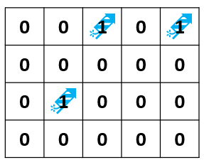
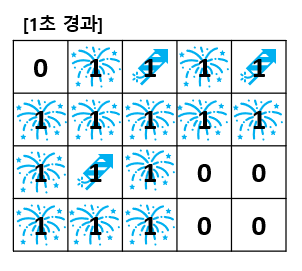
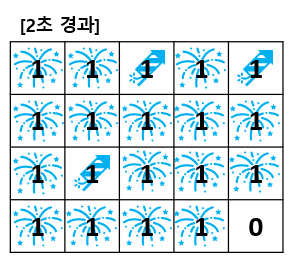
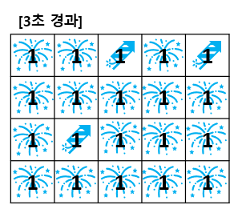

# 폭죽

## 1. 문제

- 현준이가 설치한 폭죽은 1초당 한번씩 불꽃이 사방으로 퍼져나갑니다.
- 폭죽이 한번 터질 때 마다 8방향 으로 터져 나가고, 연달아 8 방향 (⬅⬉⬆⬈➡⬊⬇⬋)으로 또 터집니다.
- 만약 0초에 폭죽이 1개 있다면,
- 1초에는 폭죽이 8 방향으로 불꽃으로 터집니다.
- 2초에는 8개 불꽃이 각각 8 방향으로, 총 64개 방향으로 퍼집니다.
- 3초에는 64개 불꽃은 64 x 8 = 512 방향으로 퍼집니다.
- 먼저 4 x 5 사이즈의 맵을 입력 받으세요.
- 0은 빈 하늘을, 1은 폭죽을 의미합니다.
- **예시**

> 
>
> - **1초 경과**
>
> 
>
> - **2초 경과**
>
> 
>
> - **3초 경과**
>
> 
>
> - 예시에서 하늘을 불꽃으로 모두 채우는데 걸리는 시간은 3초 입니다.

## 2. 입력
- 4 X 5 사이즈의 맵을 입력 하세요.

## 3. 출력
- 하늘 전체를 불꽃으로 채우는데 걸리는 시간을 출력 해주세요.

## 4. 예제 입력
```
0 0 1 0 1
0 0 0 0 0
0 1 0 0 0
0 0 0 0 0
```

## 5. 예제 출력
```
3
```

## 6. 코드
```c++
#include<iostream>
using namespace std;

struct Node {
	int y, x;
	int level;
};

Node vect[21];
int map[4][5];

int main() {
	int head = 0, tail = 0;
	int direct[8][2] = {
		-1, -1,
		-1, 0,
		-1, 1,
		0, -1,
		0, 1,
		1, -1,
		1, 0,
		1, 1
	};

	for (int i = 0; i < 4; i++) {
		for (int j = 0; j < 5; j++) {
			cin >> map[i][j];
			if (map[i][j]) {
				vect[tail++] = { i, j, 0 };
			}
		}
	}

	while (head != tail) {
		Node now = vect[head++];

		for (int t = 0; t < 8; t++) {
			int dy = now.y + direct[t][0];
			int dx = now.x + direct[t][1];

			if (dy >= 0 && dx >= 0 && dy < 4 && dx < 5 && !map[dy][dx]) {
				vect[tail++] = { dy, dx, now.level + 1 };
				map[dy][dx] = 1;
			}
		}
	}

	cout << vect[tail - 1].level;


	return 0;
}
```
