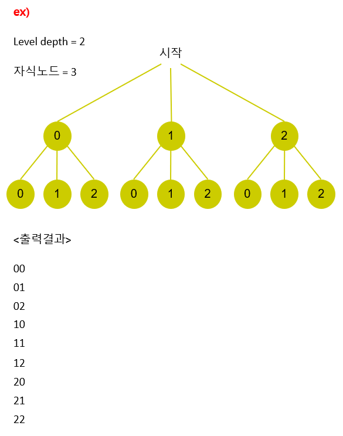

# Tree 01

## 1. 문제

- 트리의 높이와 브랜치 수를 입력받고, 아래의 그림과 같이 동작하는 재귀함수를 구현해주세요.
- 그 후, 마지막 레벨에서 경로를 출력해주세요.
- 

## 2. 입력
- 첫 줄: 트리의 높이를 입력받는다.
- 마지막 줄: 브랜치 수를 입력받는다.

## 3. 출력
- 트리를 탐색하다가, 트리의 마지막 레벨에 도달하면 경로를 출력해주세요.

## 4. 예제 입력
```
2
3
```

## 5. 예제 출력
```
0 0
0 1
0 2
1 0
1 1
1 2
2 0
2 1
2 2
```

## 6. 코드
```c++
#include <iostream>
using namespace std;

int path[1999] = { 0 };
void run(int start, int end, int branch) {
    if (start == end) {
        for (int i = 0; i < end; i++) {
            cout << path[i] << " ";
        }
        cout << "\n";
        return;
    }

    for (int i = 0; i < branch; i++) {
        path[start] = i;
        run(start + 1, end, branch);
        path[start] = 0;
    }
}

int main()
{
    int n, m;
    cin >> n >> m;

    run(0, n, m);

    return 0;
}
```
