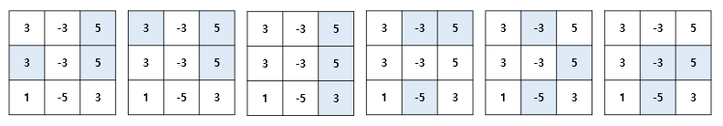

# 세 가지 선택

## 1. 문제

- **\* Backtracking 으로 풀어주세요.**
- 3 x 3 숫자판에서 3개의 숫자를 선택해주세요.
- 선택한 세 개의 숫자를 곱하고 가장 큰 값을 가지는 경우의 총 수를 구해주세요.


- 아래 이미지의 예제에서는 MAX 값인 48 이 나오는 조합이 총 4개 있습니다.


- **예제**

> - 아래 예제에서는 총 7가지 조합이 있습니다. MAX 값은 75 입니다.
>
> 

## 2. 입력

- 3 x 3 숫자 맵을 입력 받아주세요.

## 3. 출력

- 가장 큰 숫자를 가지는 조합의 총 개수를 출력 해주세요.


## 4. 예제 입력
```
-4 1 3
3 -1 4
-3 4 0
```

## 5. 예제 출력
```
4
```

## 6. 코드

```c++
#include <iostream>
using namespace std;

int map[3][3];
int used[3][3];
int path[4];
int maxi = -21e8;
int cnt = 0;
void run(int level, int sum, int ny, int nx) {
    if (level == 3) {
        if (maxi < sum) {
            
            maxi = sum;
            cnt = 1;
        }
        else if (maxi == sum) {
            cnt++;
        }
        
        return;
    }

    for (int i = ny; i < 3; i++) {
        int flag = 0;
        for (int j = 0; j < 3; j++) {
            if (ny == i && !flag) {
                j = nx;
                flag = 1;
            }
            if (used[i][j]) continue;
            used[i][j] = 1;
            path[level] = map[i][j];
            run(level + 1, sum * map[i][j], i, j);
            used[i][j] = 0;
        }
    }
}


int main()
{
     for (int i = 0; i < 3; i++) {
        for (int j = 0; j < 3; j++) {
            cin >> map[i][j];
        }
    }

    run(0, 1, 0, 0);
    cout << cnt;

    return 0;
}
```
