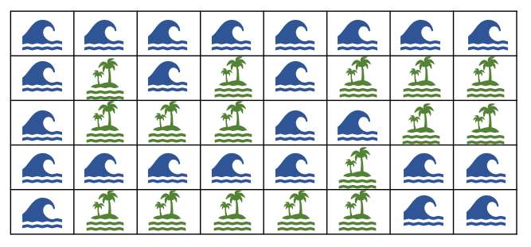

# 섬 사이즈 구하기

## 1. 문제

- 주어지는 지도에 몇개의 섬이 존재하는지 찾아내야 합니다.
- 지도는 5 x 8 크기로 주어지며, 하나의 섬은 **상, 하, 좌, 우**로 이어져있습니다.
- 예를들어, 아래 지도와 같은 경우 이어져 있는 섬의 개수는 총 3개 입니다.



## 2. 입력
- 5 x 8 크기의 지도 정보가 입력 됩니다.
- 섬은 1, 바다는 0 으로 입력 됩니다. 

## 3. 출력

- 이어져 있는 각 섬의 총 개수를 출력 하세요.


## 4. 예제 입력
```
0 0 0 0 0 0 0 0
0 1 0 1 0 1 1 1
0 1 1 1 0 0 1 1
0 0 0 0 0 1 0 0
0 1 1 1 1 1 0 0
```

## 5. 예제 출력
```
3
```

## 6. 코드

```c++
#include <iostream>
using namespace std;

struct Node {
    int y, x;
};

int map[5][8], visited[5][8] = { 0, };
int direct[4][2] = { -1, 0, 1, 0, 0, -1, 0, 1 };

void bfs(int y, int x) {
    int head = 0, tail = 1;

    visited[y][x] = 1;
    Node arr[1000] = { { y, x }, };

    while (head != tail) {
        Node now = arr[head++];

        for (int t = 0; t < 4; t++) {
            int dy = now.y + direct[t][0];
            int dx = now.x + direct[t][1];
            
            if (dy < 0 || dx < 0 || dy >= 5 || dx >= 8) continue;
            if (!map[dy][dx]) continue;
            if (visited[dy][dx]) continue;
            visited[dy][dx] = 1;

            arr[tail++] = { dy, dx };
        }
    }
}

int main()
{
    int cnt = 0;

    for (int i = 0; i < 5; i++) {
        for (int j = 0; j < 8; j++) {
            cin >> map[i][j];
        }
    }
    
    for (int i = 0; i < 5; i++) {
        for (int j = 0; j < 8; j++) {
            if (!map[i][j]) continue;
            if (visited[i][j]) continue;
            
            bfs(i, j);
            cnt++;
        }
    }

    cout << cnt;

    return 0;
}

```
