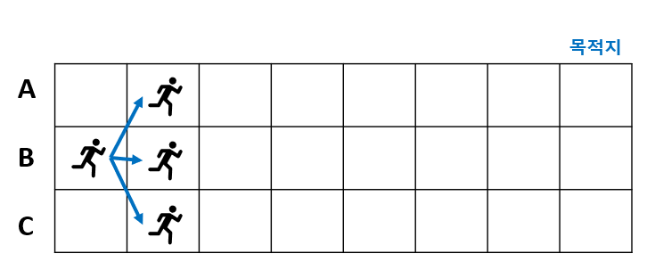
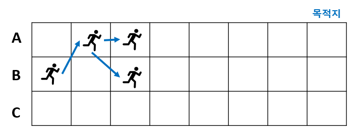

# 취객의 걸음걸이 #

## 1. 문제
- 취객은 목적지까지 걸어가는데 비틀비틀 움직입니다.



- 세 방향으로 움직일 수 있습니다.
- 취객이 만약 B에서 출발한다면, 첫걸음에 갈 수 있는 곳은 (0,1), (1,1), (2,1) 입니다.
- 만약 (0,1)에 도착한다면 (2,0) 또는 (2,1)로 움직일 수 있습니다.



- 이렇게 취객이 비틀비틀 움직일때, 목적지에 도착할 수 있는 경우의 수가 총 몇 가지 존재하는지 출력하세요.

## 2. 입력
- 취객이 출발할 방향(A, B, C)을 입력 받습니다.

## 3. 출력
- 목적지에 도착할 수 있는 경우의 수가 총 몇 가지 존재하는지 출력하세요.

## 4. 예제 입력
```
A
```

## 5. 예제 출력
```
408
```

## 6. 코드

```c++
#include <iostream>
using namespace std;

int cnt = 0;
char path[10];
int direct[3] = { -1, 0, 1 };
void run(int level, int now) {
	if (level == 7) {
		cnt++;
		return;
	}

	for (int i = 0; i < 3; i++) {
		if (now + direct[i] < 0 || now + direct[i] > 2) continue;
		path[level] = '0' + now;
		run(level + 1, now + direct[i]);
		path[level] = 0;
	}
}

int main() {
	char ch;
	cin >> ch;

	if (ch == 'A') {
		run(0, 0);
	}
	else if (ch == 'B') {
		run(0, 1);
	}
	else {
		run(0, 2);
	}

	cout << cnt;

	return  0;
}

```
