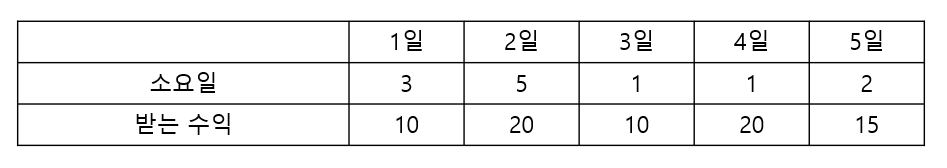
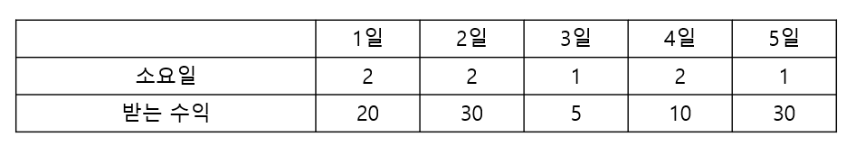

# 고객센터 스케줄 #

## 1. 문제
- 상담 스케쥴을 조정하여 얻을 수 있는 수익의 최대 금액을 구해주세요.
- 상담 업무를 할 수 있는 스케쥴 표가 주어집니다.



- 만약, 1일 업무를 맡게 된다면, 1,2,3일은 상담 업무를 하게 되고, 10만원을 벌 수 있습니다.
- 그리고, 4일 업무를 맡지 않고 5일 업무를 맡게 된다면 5일, 6일에 상담 업무를 할 수 있고, 총 10 + 15 = 25만원을 벌 수 있습니다.
- 위 스케쥴 표에서는 1일, 4일, 5일에서 일을 하면 최대 45만원을 벌 수 있습니다.

> - 아래 예제에서는 2일, 5일 일을 하면 최대 60만원을 벌 수 있습니다.
>
> 

## 2. 입력
- 스케쥴 날짜의 개수 N이 입력됩니다. 
- 다음 줄에, 상담 소요일과 받는 수익이 입력 됩니다. 

## 3. 출력
- 상담 스케쥴을 조정하여 가장 수익을 많이 벌 수 있는 금액을 출력하세요.

## 4. 예제 입력
```
5
3 10
5 20
1 10
1 20
2 15
```

## 5. 예제 출력
```
45
```

## 6. 코드
```c++
#include <iostream>
#include <vector>
using namespace std;

struct Node {
    int x;
    int cost;
};

int n, maxi = -21e8;
vector<Node> p;

void run(int level, int sum) {
    if (n <= level) {
        if (maxi < sum) maxi = sum;
        return;
    }

    run(level + p[level].x, sum + p[level].cost);
    run(level + 1, sum);
}

int main()
{
    cin >> n;

    for (int i = 0; i < n; i++) {
        int t, w;
        cin >> t >> w;

        p.push_back({ t, w });
    }

    run(0, 0);
    cout << maxi;

    return 0;
}
```
