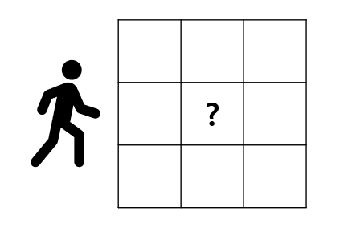
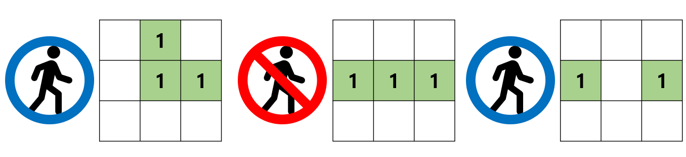

# 정상 등반

## 1. 문제
- John과 Smith 산악 팀은 악명높은 레드 마운틴 트래킹에 도전 중 입니다.
- 그들이 트래킹하려는 N x N 공간이 주어지고, 출발 지점 (0, 0)부터 도착 지점(n - 1, n - 1) 까지 도착할 수 있는지 확인하고자 합니다.



- 그들은 상, 하, 좌, 우로 한 칸씩 이동 가능합니다.
- 맵의 갈 수 있는 곳은 0으로, 지나갈 수 없는 곳은 1로 표현됩니다.
- 아래 세 이미지는 n = 3 일때 예시입니다.
- 첫번째와 세번째 이미지는 (0, 0) -> (2, 2)로 트래킹이 가능하며,
- 두 번째 이미지는 길이 막혀있기에 트래킹이 불가능합니다.



- 그들이 헤매지않도록, 목적지까지 갈 수 있는지 가능여부를 알려주는 프로그램을 작성해 주세요.

## 2. 입력
- 맵의 가로 세로 사이즈인 n 이 입력 됩니다. (1 <= n <= 15)
- 다음 줄 부터 n x n 맵 정보가 입력 됩니다.
- 이동 가능한 지역은 0 으로, 이동 불가한 지역은 1 로 입력 됩니다.

## 3. 출력
- (0, 0) 에서 (n - 1, n - 1) 지점까지 이동이 확인하여, "가능" 또는 "불가능"을 출력해 주세요.

## 4. 예제 입력
```
3
0 1 0
0 1 1
0 0 0
```

## 5. 예제 출력
```
가능
```

## 6. 코드
```c++
#include <iostream>
#include <algorithm>
#include <string>
using namespace std;

int map[3][3];
int visit[3][3] = { 1, };
int direct[4][2] = {
	-1, 0,
	1, 0,
	0, -1,
	0, 1
};

int flag = 0;
void run(int ny, int nx) {
	if (ny == 2 && nx == 2) {
		flag = 1;
		return;
	}

	for (int t = 0; t < 4; t++) {
		int dy = ny + direct[t][0];
		int dx = nx + direct[t][1];

		if (flag) return;
		if (dy < 0 || dx < 0 || dy > 2 || dx > 2) continue;
		if (map[dy][dx] || visit[dy][dx]) continue;

		visit[dy][dx] = 1;
		run(dy, dx);
	}
}

int main()
{
	for (int i = 0; i < 3; i++) {
		for (int j = 0; j < 3; j++) {
			cin >> map[i][j];
		}
	}

	run(0, 0);

	if (flag) cout << "가능";
	else cout << "불가능";

}
```
