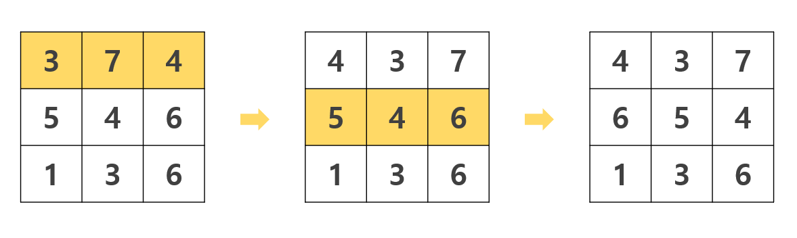
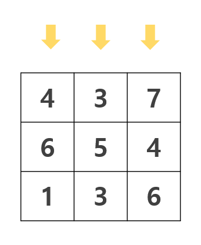

# 가로 큐브 회전시키기 #

## 1. 문제
- 가로줄을 돌릴 수 있는 N x N 2차원 큐브가 있습니다.
- 큐브의 각 칸에는 -9 부터 9 까지 수가 적혀있습니다.
- 이 큐브는 세로로 돌릴 수 없고, 가로로만 회전시킬 수 있습니다.
- 아래 이미지는 N = 3 일때 예시입니다.
- 윗 라인을 1회 회전 후, 중간 라인을 1회 회전시켰습니다.
- 큐브는 항상 가로 방향으로 오른쪽으로만 회전이 가능합니다.



- 우리는 최고의 "완성 점수"를 내도록 큐브를 적절히 돌려야만 합니다.

> - **[완성 점수를 계산하는 방법]**
> - 점수는 세로 줄의 합을 구한 후, 그 수들의 곱으로 점수를 계산할 수 있습니다.
>
> 
>
> - 위와 같은 예시에서는,
>   	윗라인 : 4 + 6 + 1 = 11
>   	중간라인 : 3 + 5 + 3 = 11
>   	아래라인 : 7 + 4 + 6 = 17
>   	완성 점수 : 11 x 11 x 17 = 2,057 점을 얻을수 있습니다.
> - 위 예시에서는 2,057점을 얻을 수 있지만, 더 높은 점수를 얻을수도 있습니다.
> - 큐브 상태를 입력받고, 큐브를 돌려, 최대 완성점수를 출력해 주세요.

## 2. 입력
- 큐브의 사이즈 N과 (3 <= N <= 5)
- N x N 사이즈의 큐브에 쓰여진 수들이 입력 됩니다. (-9 <= 쓰여진 값 <= 9)

## 3. 출력
- 완성점수의 MAX 값을 출력해 주세요.

## 4. 예제 입력
```
3
4 3 7
5 4 6
6 1 3
```

## 5. 예제 출력
```
2184점
```

## 6. 코드

```c++
#include <iostream>
using namespace std;

int map[3][3];

void left(int ny) {
    int t = map[ny][0];
    map[ny][0] = map[ny][1];
    map[ny][1] = map[ny][2];
    map[ny][2] = t;
}

void right(int ny) {
    int t = map[ny][2];
    map[ny][2] = map[ny][1];
    map[ny][1] = map[ny][0];
    map[ny][0] = t;
}

int maxi = -21e8;
void run(int level) {
    int a = map[0][0] + map[1][0] + map[2][0];
    int b = map[0][1] + map[1][1] + map[2][1];
    int c = map[0][2] + map[1][2] + map[2][2];

    int t = a - b + c;
    if (t > maxi) maxi = t;

    if (level == 3) {
        return;
    }

    right(0);
    run(level + 1);
    left(0);

    right(1);
    run(level + 1);
    left(1);

    right(2);
    run(level + 1);
    left(2);
}

int main()
{
    for (int i = 0; i < 3; i++) {
        for (int j = 0; j < 3; j++) {
            cin >> map[i][j];
        }
    }

    run(0);

    cout << maxi << "점";

    return 0;
}
```
