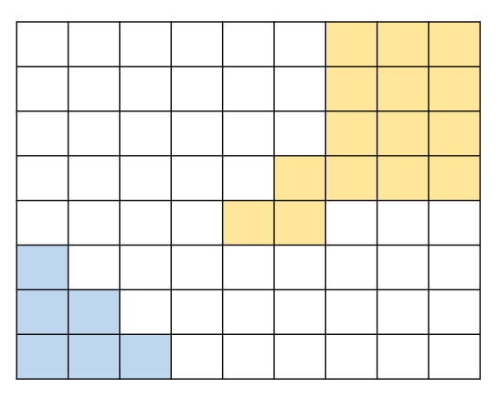

# 가장 가까운 섬 찾기 #

## 1. 문제
- 천지창조는 신이 인간을 흙으로 만들고 생명을 불어 넣는 것을 표현한 그림입니다.
- 아래 그림에서 이 두사람은 각각 **오른쪽 위 와 왼쪽 아래 모서리에 배치**되어 있습니다.



- 아래는 8 x 9 Size의 pixel로 표현 한 예제입니다.

> - **[힌트]**
>   1. 한 사람을 기준으로 BFS돌려 한사람의 좌표를 큐에 모두 넣습니다.
>   2. 다시 BFS를 돌려 가장 가까운 땅의 거리를 찾습니다.

## 2. 입력
-  8 x 9 크기의 그림 정보를 입력 해주세요.

## 3. 출력
- 두 사람을 연결하기 위한 최소 거리를 출력해주세요.
- *** 상, 하, 좌, 우 방향으로만 연결될 수 있습니다.**

## 4. 예제 입력
```
______###
______###
______###
_____####
____##___
#________
##_______
###______
```

## 5. 출력

```
4
```

## 6. 코드

```c++
#include <iostream>
using namespace std;

struct Node {
	int y, x;
	int level;
};

Node vect[1000];
char map[8][10], head = 0, tail = 1;
int visited[8][9] = { 0, };
int direct[4][2] = { 0, -1, 0, 1, 1, 0, -1, 0 };

int bfs(char target) {
	while (head != tail) {
		Node now = vect[head++];

		for (int t = 0; t < 4; t++) {
			int dy = now.y + direct[t][0];
			int dx = now.x + direct[t][1];

			if (dy < 0 || dx < 0 || dy >= 8 || dx >= 9) continue;
			if (visited[dy][dx]) continue;
			if (target == '_' && map[dy][dx] == '#') return now.level;
			if (map[dy][dx] != target) continue;

			visited[dy][dx] = 1;

			if (target == '#') {
				vect[tail++] = { dy, dx, 0 };
			}
			else {
				vect[tail++] = { dy, dx, now.level + 1 };
			}

		}
	}

	head = 0;
}

void init() {
	for (int i = 0; i < 8; i++) {
		cin >> map[i];
	}

	for (int i = 0; i < 8; i++) {
		for (int j = 0; j < 9; j++) {
			if (map[i][j] == '#') {
				vect[0] = { i, j, 0 };
				visited[i][j] = 1;
				bfs('#');
				return;
			}
		}
	}
}

int main() {
	init();

	cout << bfs('_');

	return 0;
}
```