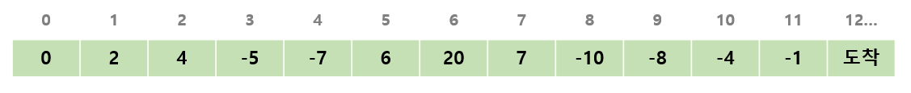

# 금지 단어 수정 프로그램

## 1. 문제
- 독재자 알프레도는 국민들에게 금지어를 발표했습니다.
- 한 문자열을 입력받아주세요.
- 그리고 아래 표를 참조하여, 정책에 맞게 **단어를 수정해주는 프로그램을 작성**해주세요.



> **[힌트]**
> replace 함수를 구현하면,
> 쉽게 문제를 풀 수 있습니다.

## 2. 입력
- 한 문자열을 입력받는다.

## 3. 출력
- 수정된 결과를 출력한다.

## 4. 예제 입력
```
ILOVEKFCANDMC!!
```

## 5. 예제 출력
```
ILOVE#BBQ#AND#BBQ#!!
```

## 6. 코드
```c++
#include <iostream>
#include <vector>
#include <string>
using namespace std;

vector<string> before = { "KFC", "MC", "BICMAC", "SHACK", "SONY" };
vector<string> after = { "#BBQ#", "#BBQ#", "#MACBOOK#", "#SHOCK#", "#NONY#" };

void replace(string be, string af, int index) {

}

int main()
{
    int sIndex = 0, eIndex;
    string str;
    cin >> str;

    for (int i = 0; i < before.size(); i++) {
        while (1) {
            sIndex = str.find(before[i], sIndex);

            if (sIndex == -1) break;

            str.replace(sIndex, before[i].length(), after[i]);
        }
        sIndex = 0;
    }

    cout << str;

    return 0;
 }

```
