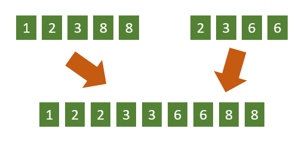

# 정렬된 배열 합치기

## 1. 문제


- **두 정렬된** 배열을 입력받습니다. (정렬되어있는 입력 데이터입니다)

- while을 돌려서 두 배열을 하나의 정렬된 배열로 만들어주세요. (입력되는 각 숫자들은 0 ~ 9 사이의 숫자입니다.)

## 2. 입력
- **두 정렬된** 배열을 입력받습니다. (정렬되어있는 입력 데이터입니다)

## 3. 출력
- 두 배열을 하나의 정렬된 배열로 만들어 출력해주세요.

## 4. 예제 입력
```
12388
2366
```

## 5. 예제 출력
```
122336688
```

## 6. 코드
```c++
#include <iostream>
#include <vector>
#include <string>
using namespace std;

vector<int> lArr;
vector<int> rArr;
vector<int> result;

int main()
{
    int indexL = 0, indexR = 0;
    string a, b;
    cin >> a >> b;

    int lSize = a.length(), rSize = b.length();

    for (int i = 0; i < lSize; i++) {
        lArr.push_back(a[i] - '0');
    }

    for (int i = 0; i < rSize; i++) {
        rArr.push_back(b[i] - '0');
    }

    while (indexL < lSize || indexR < rSize) {
        if (indexL == lSize) {
            result.push_back(rArr[indexR++]);
        } 
        else if (indexR == rSize) {
            result.push_back(lArr[indexL++]);
        }
        else if (lArr[indexL] >= rArr[indexR]) {
            result.push_back(rArr[indexR++]);
        }
        else {
            result.push_back(lArr[indexL++]);
        }
    }

    for (int i = 0; i < result.size(); i++) {
        cout << result[i];
    }
}
```
