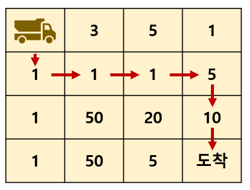

# 지게차 경로 #

## 1. 문제
- 지게차는 4 x 4 맵에서 (0, 0) 에 있습니다.
- 그리고 도착지점(3, 3)까지 최단거리로 이동하려고 합니다.
- 바닥상태가 좋지 않아 땅을 밟을 때 마다, 지게차는 써있는 숫자만큼 손상 되곤 합니다.
- 최단거리로 도착지점까지 가려고 할 때, **최소 데미지를 받는 경로를 출력 해 주세요.**



```
[예시]
만약 위의 그림과 같이 MAP을 입력받는다면,

출력결과는 아래와 같습니다.
0,0
1,0
1,1
1,2
1,3
2,3
3,3
```

> **[세부 조건]**
>
> 1. 맵 사이즈는 4 x 4로 고정입니다.
> 2. 시작지점(0, 0)과 도착지점(3, 3)의 값은 항상 0 입니다.

## 2. 입력

- 4x4 사이즈의 2차원 배열을 입력 받습니다.

## 3. 출력
- 최단거리로 도착지점까지 가려고 할 때, **최소 데미지를 받는 경로를 출력 해 주세요.**

## 4. 예제 입력
```
0 3 5 1
1 1 1 5
1 50 20 10
1 50 5 0
```

## 5. 예제 출력
```
0,0
1,0
1,1
1,2
1,3
2,3
3,3
```

## 6. 코드

```c++
#include <iostream>
#include <vector>
#include <algorithm>
#include <string>
using namespace std;

enum Direct {
	RIGHT,
	DOWN
};

int map[4][4];
int direct[4][4];
int resMap[4][4] = { 0 };

void init() {
	for (int i = 0; i < 4; i++) {
		for (int j = 0; j < 4; j++) {
			cin >> map[i][j];
		}
	}

	for (int i = 0; i < 3; i++) {
		direct[i][3] = DOWN;
		direct[3][i] = RIGHT;
	}

	for (int i = 2; i >= 0; i--) {
		resMap[i][3] = map[i][3] + resMap[i + 1][3];
		resMap[3][i] = map[3][i] + resMap[3][i + 1];
	}
}

int main()
{
	init();

	for (int i = 2; i >= 0; i--) {
		for (int j = 2; j >= 0; j--) {
			int dv = map[i][j] + resMap[i + 1][j];
			int rv = map[i][j] + resMap[i][j + 1];

			if (dv >= rv) {
				resMap[i][j] = rv;
				direct[i][j] = RIGHT;
			} 
			else {
				resMap[i][j] = dv;
				direct[i][j] = DOWN;
			}
		}
	}

	int y = 0, x = 0;
	while (1) {
		cout << y << "," << x << "\n";

		if (y == 3 && x == 3) break;

		if (direct[y][x] == RIGHT) x++;
		else y++;
	}

	return 0;
}
```
