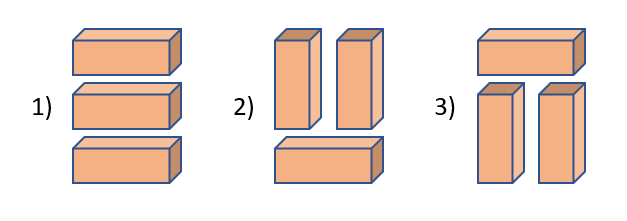
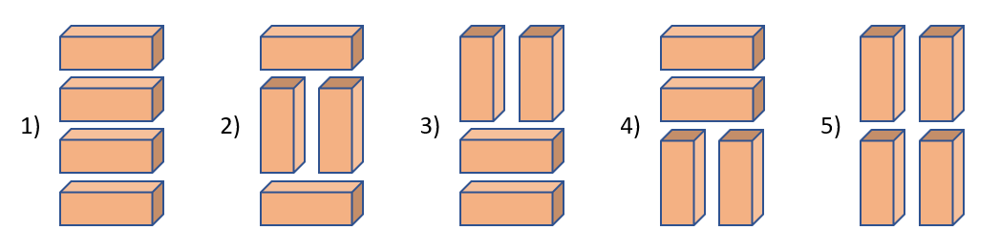

# 사각 도형 쌓기 #

## 1. 문제

- 1x2 사이즈의 나무토막이 있습니다.
- 3단까지 나무를 쌓는 방법은 아래와 같이 총 세가지 입니다.



- 4단까지 나무를 쌓는 방법은 총 다섯가지 입니다.



- **n단까지 나무를 쌓으려고 할때 가능한 방법수를 출력해주세요. ** **(Dynamic Programming 문제 입니다.)**

> **[HINT]**
> [1]단
> -> [0]단에서 가로 1개 쌓기
> -> 경우의 수 : 1
>
> [2]단
> -> [1]단에서 1개 더 올리기
>  \+ [0]단에서 세로로 쌓기
> -> 경우의 수 : 2
>
> [3]단
> -> [2]단에서 1개 더 올리기
> -> [1]단에서 세로로 쌓기
> -> 경우의수 : 3
>
> [4]단
> -> [3]단에서 1개 더 올리기
> -> [2]단에서 세로로 쌓기
> -> 경우의수 : 5
>
> [5]단
> -> [4]단에서 1개 더 올리기
> -> [3]단에서 세로로 쌓기
> -> 경우의 수 : 8

## 2. 입력
- 몇 단을 쌓을지 입력 받습니다.

## 3. 출력
- 경우의 수를 출력해주세요.

## 4. 예제 입력
```
4
```

## 5. 예제 출력
```
5
```

## 6. 예제 입력

```
3
```

## 7. 예제 출력

```
3
```

## 8. 코드

```c++
#include <iostream>
using namespace std;

int dan;
int map[100] = { 1, 2, 0, };

void init()
{
    cin >> dan;
}

int main()
{
    init();

    for (int i = 2; i < dan; i++) {
        map[i] = map[i - 2] + map[i - 1];
    }

    cout << map[dan - 1];

    return 0;
}

```
