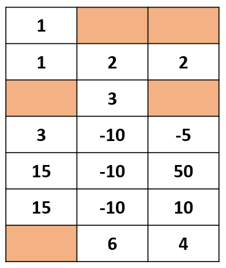

# 아래로 점프!

## 1. 문제


- 7x3 맵을 입력 받으세요.
- (0,0) 좌표에 있는 개구리는 **↙↓↘로 한 칸 점프 할 수 있습니다. (벽으로 이동 불가)**
- 숫자가 써있는 곳을 밟으면, 그 숫자만큼 점수를 얻습니다.
- 개구리가 맨 밑까지 내려올, 때 개구리가 받을 수 있는 최대 점수는 몇일까요?
- **(숫자 0은 벽 입니다. DP로 풀어주세요.)**

## 2. 입력
- 7x3 맵을 입력 받는다.

## 3. 출력
- 개구리가 맨 밑까지 내려올, 때 개구리가 받을 수 있는 최대 점수를 출력해주세요.

## 4. 예제 입력
```
1 0 0
1 2 2
0 3 0
3 -10 -5
15 -10 50
15 -10 10
0 6 4
```

## 5. 예제 출력
```
67
```

## 6. 코드

```c++
#include <iostream>
using namespace std;

int map[7][3];
int scoreMap[7][3] = { 0 };
int flagMap[7][3] = { 0 };
int direct[3] = { -1, 0, 1 };

void init()
{
    for (int i = 0; i < 7; i++) {
        for (int j = 0; j < 3; j++) {
            cin >> map[i][j];
        }
    }

    for (int i = 0; i < 3; i++) scoreMap[6][i] = map[6][i];
}

int main()
{
    init();

    for (int i = 6; i >= 1; i--) {
        for (int j = 0; j < 3; j++) {
            if (map[i][j] == 0) continue;

            for (int t = 0; t < 3; t++) {
                int dx = j + direct[t];

                if (dx >= 0 && dx < 3 && map[i - 1][dx] != 0) {
                    int temp = scoreMap[i][j] + map[i - 1][dx];

                    if (scoreMap[i - 1][dx] < temp || !flagMap[i - 1][dx]) {
                        scoreMap[i - 1][dx] = temp;
                        flagMap[i - 1][dx] = 1;
                    }
                }
            }
        }
    }

    cout << scoreMap[0][0];
}

```
