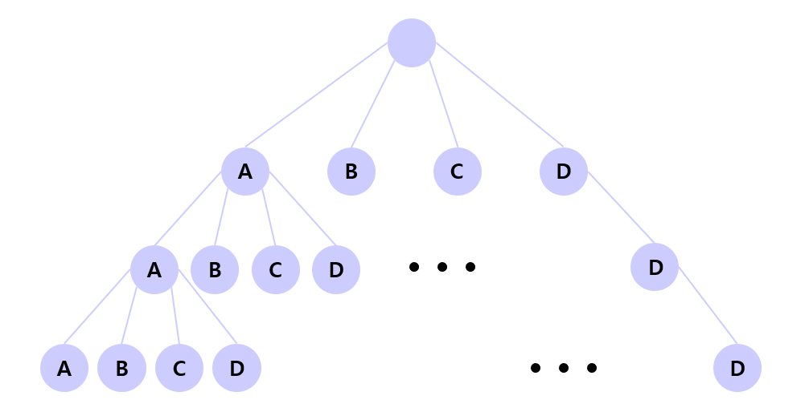

# 몇 번째 Path인지 찾기

## 1. 문제

- 아래의 이미지에 있는 트리를 재귀로 만들려고 합니다.
- Level 3의 경로를 하나 입력받고, 해당 경로가 몇번째로 만들어지는지 찾아서 출력하세요.




## 2. 입력

- Level 3의 경로를 하나 입력받습니다.

## 3. 출력

- 해당 경로가 몇번째로 만들어지는지 찾아서 출력하세요.


## 4. 예제 입력
```
AAD
```

## 5. 예제 출력
```
4번째
```

## 6. 코드

```c++
#include <iostream>
#include <cstring>
using namespace std;

int cnt = 0;
char ch[4];
char map[4];

void run(int start, int end) {
    if (start == end) {
        cnt++;
        if (!strcmp(map, ch)) cout << cnt << "번째";
        return;
    }

    for (int i = 0; i < 4; i++) {
        map[start] = 'A' + i;
        run(start + 1, end);
    }
}

int main()
{
    cin >> ch;
    run(0, 3);
}
```
