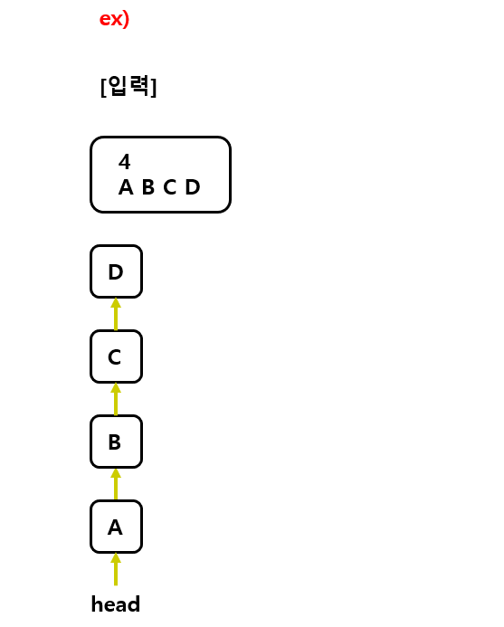

# Linked list Line

## 1. 문제

- Linked list로 Line을 구현할려고 합니다.
- 입력받은 문자들을 모두 Linked list에 등록하고, 등록 후 다시 처음부터 출력해주세요.



## 2. 입력
- 첫 줄: 입력받을 문자의 갯수 n을 입력 받습니다.
- 마지막 줄: n개의 문자들을 입력 받습니다.

## 3. 출력

- 입력받은 문자들을 모두 Linked list에 등록하고, 등록 후 다시 처음부터 출력해주세요.

## 4. 예제 입력

```
4
A B C D
```

## 5. 예제 출력
```
A B C D
```

## 6. 코드

```c++
#include <iostream>
using namespace std;

struct Node {
	char data;
	Node* next;
};

Node* head, * last;

void addNode(char x) {
	if (head == NULL) {
		head = new Node({ x });
		last = head;
		return;
	}

	last->next = new Node({ x });
	last = last->next;
}

int main() {
	int n;
	cin >> n;

	for (int i = 0; i < n; i++) {
		char ch;
		cin >> ch;

		addNode(ch);
	}

	for (Node* p = head; p != NULL; p = p->next) {
		cout << p->data << " ";
	}

	return 0;
}
```
