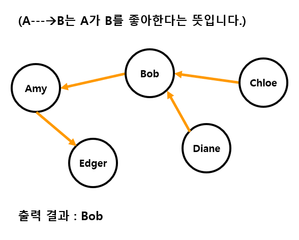

# 삼각관계 2

## 1. 문제

- 아래의 이미지는 삼각 관계를 나타낸 그래프 입니다.
- 그래프를 인접행렬로 작성하여, 행렬을 이용하여 5명 중에 가장 인기가 많은 사람을 출력해주세요.



## 2. 출력

- 인접 행렬을 이용하여 5명 중에 가장 인기가 많은 사람을 출력해주세요.

## 3. 출력 예시

```
Bob
```

## 4. 코드

```c++
#include <iostream>
#include <string>
using namespace std;

struct Node {
	string name;
	Node* next;
};

Node* head[5], * last[5];

void addNode(int idx, string name) {
	if (head[idx] == NULL) {
		head[idx] = new Node({ name });
		last[idx] = head[idx];
		return;
	}

	last[idx]->next = new Node({ name });
	last[idx] = last[idx]->next;
}

int main() {
	string person[5] = { "Amy", "Bob", "Chloe", "Edger", "Diane" };

	addNode(0, "Bob");

	addNode(1, "Chloe");
	addNode(1, "Diane");

	addNode(3, "Amy");

	int max = -1, idx;
	for (int i = 0; i < 5; i++) {
		int cnt = 0;
		for (Node* p = head[i]; p != NULL; p = p->next) {
			cnt++;
		}
		if (max < cnt) {
			max = cnt;
			idx = i;
		}
	}

	cout << person[idx];

	return 0;
}
```
