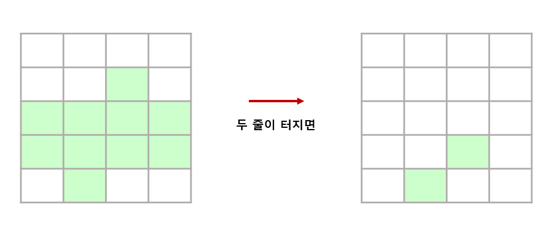

# 테트리스

## 1. 문제

- 테트리스는 한 줄이 꽉 차면 그 줄은 사라지게 됩니다.
- 블럭 상태를 입력 받고, 꽉찬 줄이 터지고 난 후의 결과를 출력해주세요.
- 예시)



- 터진 줄만 제거하고, 위에 블럭은 완전히 바닥에 떨어지는 것이 아닙니다.

## 2. 입력

- 2차원 배열(5x4)를 입력 받습니다.

## 3. 출력

- 꽉찬 줄이 있다면 터진 후의 최종 상태를 출력해주세요.

## 4. 입력 예시

```
0 0 0 0
0 0 1 0
1 1 1 1
1 1 1 1
0 1 0 0
```

## 5. 출력 예시

```
0 0 0 0
0 0 0 0
0 0 0 0
0 0 1 0
0 1 0 0
```

## 6. 코드

```c++
#include <iostream>
using namespace std;

int main() {
	int map[5][4] = { 0 };
	int check[5] = { 0 };
	for (int i = 0; i < 5; i++) {
		int cnt = 0;
		for (int j = 0; j < 4; j++) {
			cin >> map[i][j];
			if (map[i][j] == 1) cnt++;
		}

		if (cnt == 4) {
			for (int j = 0; j < 4; j++) {
				map[i][j] = 0;
			}
		}
	}

	for (int i = 0; i < 5; i++) {
		int flag = 0;
		for (int j = 0; j < 4; j++) {
			if (map[i][j] == 1) {
				flag = 1;
				break;
			}
		}

		check[i] = flag;
	}

	for (int i = 4; i >= 1; i--) {
		if (check[i] == 0) {
			for (int j = i - 1; j >= 0; j--) {
				if (check[j] == 1) {
					for (int k = 0; k < 4; k++) {
						map[i][k] = map[j][k];
						map[j][k] = 0;
					}
					break;
				}
			}
		}
	}

	for (int i = 0; i < 5; i++) {
		for (int j = 0; j < 4; j++) {
			cout << map[i][j] << " ";
		}
		cout << "\n";
	}

	return 0;
}
```
