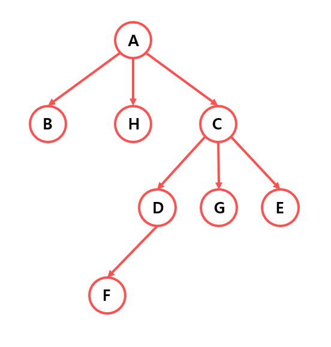

# Tree 2 #

## 1. 문제


- 위의 그래프를 인접행렬(2차원 배열(8x8))로 하드코딩 하고, 노드의 이름을 입력받고, 노드의 형제들을 출력해주세요.
- 만약, 형제가 없다면"없음"을 출력해주세요.

## 2. 입력

-  노드의 이름을 하나 입력 받아주세요.

## 3. 출력
- 노드의 형제들을 출력해주세요.

## 4. 예제 입력
```
G
```

## 5. 출력

```
D E
```

## 6. 코드

```c++
#include <iostream>
using namespace std;

int main()
{
    int map[8][8] = {
    0, 1, 1, 1, 0, 0, 0, 0,
    0, 0, 0, 0, 0, 0, 0, 0,
    0, 0, 0, 0, 0, 0, 0, 0,
    0, 0, 0, 0, 1, 1, 1, 0,
    0, 0, 0, 0, 0, 0, 0, 1,
    };

    char name[9] = "ABHCDGEF";

    char ch;
    cin >> ch;

    int targetX = -1, targetY = -1;

    for (int i = 0; i < 8; i++) {
        if (ch == name[i]) targetX = i;
    }

    for (int i = 0; i < 8; i++) {
        if (map[i][targetX] == 1) targetY = i;
    }

    int flag = 0;
    for (int i = 0; i < 8; i++) {
        if (map[targetY][i] == 1 && i != targetX) {
            cout << name[i] << " ";
            flag = 1;
        }
    }

    if (!flag) cout << "없음";

    return 0;
}
```