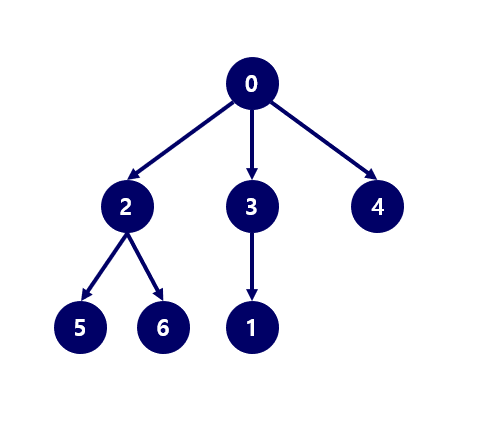

# DFS

## 1. 문제
- DFS는 그래프, 트리 탐색의 방법 중 하나입니다. 배열이나 링크드리스트는 반복문으로 쉽게 탐색이 가능하지만, 그래프와 같은 자료구조는 반복문으로 탐색이 어렵습니다.
- 그래서 DFS로 탐색하곤 합니다.
- 그래프를 N x N의 인접행렬로 입력받고,
- DFS 탐색 순서로 출력해주세요.
- 예시)



- 위의 트리로 DFS를 돌리면 출력결과는 0 2 5 6 3 1 4 가 출력된다.

## 2. 입력
- 첫 줄: 인접행렬의 사이즈를 정할 N을 입력받는다.
- 다음 줄부터: N x N의 2차원 배열을 입력받는다.

## 3. 출력
- DFS 탐색 순서로 출력해주세요.

## 4. 예제 입력
```
7
0 0 1 1 1 0 0 
0 0 0 0 0 0 0
0 0 0 0 0 1 1
0 1 0 0 0 0 0
0 0 0 0 0 0 0
0 0 0 0 0 0 0
0 0 0 0 0 0 0
```

## 5. 예제 출력
```
0 2 5 6 3 1 4
```

## 6. 코드
```c++
#include <iostream>
using namespace std;

int n, parent;
int map[100][100];

void run(int row) {
    cout << row << " ";

    for (int i = 0; i < n; i++) {
        if (map[row][i] == 1) {
            run(i);
        }
    }
}

int main()
{
    cin >> n;

    for (int i = 0; i < n; i++) {
        for (int j = 0; j < n; j++) {
            cin >> map[i][j];
        }
    }

    for (int i = 0; i < n; i++) {
        int flag = 0;
        for (int j = 0; j < n; j++) {
            if (map[i][j] == 1) {
                flag = 1;
                break;
            }
        }

        if (flag) {
            flag = 0;
            for (int j = 0; j < n; j++) {
                if (map[j][i] == 1) {
                    flag = 1;
                    break;
                }
            }
            if (!flag) {
                parent = i;
                break;
            }
        }
    }

    run(parent);

    return 0;
}
```
