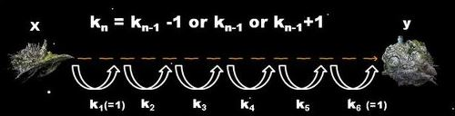

# Fmtt Alpha

## 1. 문제

- 최홍우는 어린 시절, 지구 외의 다른 행성에서도 인류들이 살아갈 수 있는 미래가 오리라 믿었다.

- 그리고 2037년이 된 지금, 홍우는 우주 비행사가 되어 새로운 세계에 발을 내려 놓는 영광의 순간을 기다리고 있다.

- 그가 탑승하게 될 우주선은 Alpha Centauri라는 새로운 인류의 보금자리를 개척하기 위한 대규모 생활 유지 시스템을 탑재하고 있기 때문에, 그 크기와 질량이 엄청난 이유로 최신기술력을 총 동원하여 개발한 공간이동 장치를 탑재하였다.

- 하지만 이 공간이동 장치는 이동 거리를 급격하게 늘릴 경우 기계에 심각한 결함이 발생하는 단점이 있어서, 이전 작동시기에 k광년을 이동하였을 때는 k-1 , k 혹은 k+1 광년만을 다시 이동할 수 있다.

- 예를 들어, 이 장치를 처음 작동시킬 경우 -1 , 0 , 1 광년을 이론상 이동할 수 있으나 사실상 음수 혹은 0 거리만큼의 이동은 의미가 없으므로 1 광년을 이동할 수 있으며, 그 다음에는 0 , 1 , 2 광년을 이동할 수 있는 것이다.

-  여기서 다시 2광년을 이동한다면 다음 시기엔 1, 2, 3 광년을 이동할 수 있다.

  

- 최홍우는 공간이동 장치 작동시의 에너지 소모가 크다는 점을 잘 알고 있기 때문에 x지점에서 y지점을 향해 최소한의 작동 횟수로 이동하려 한다.

- 하지만 y지점에 도착해서도 공간 이동장치의 안전성을 위하여 y지점에 도착하기 바로 직전의 이동거리는 반드시 1광년으로 하려 한다.

- 최홍우를 위해 x지점부터 정확히 y지점으로 이동하는데 필요한 공간 이동 장치 작동 횟수의 최소값을 구하는 프로그램을 작성하라.  

## 2. 입력
- 첫줄: 현재 위치 x 와 목표 위치 y 가 정수로 주어지며, x는 항상 y보다 작은 값을 갖는다. ( 0 ≤ x < y ≤ 100,000,000)

## 3. 출력

- 각 테스트 케이스에 대해 x지점으로부터 y지점까지 정확히 도달하는데 필요한 최소한의 공간이동 장치 작동 회수를 출력한다.


## 4. 예제 입력
```
0 3
```

## 5. 예제 출력
```
3
```

## 6. 예제 입력

```
1 5
```

## 7. 예제 출력

```
3
```

## 8. 예제 입력

```
45 50
```

## 9. 예제 출력

```
4
```

## 10. 힌트

- 첫번째 예제 입력은 1 1 1 로 세번 이동
- 두번째 예제 입력은 1 2 1 로 세번 이동
- 세번째 예제 입력은 1 2 1 1로 네번 이동
- 혹은 1 1 2 1 로 네번 이동하는 것도 가능

## 6. 코드

```c++
#include <stdio.h>

int main() {
  int x, y, z, sum = 0, cnt = 1, w = 0;
  scanf("%d %d", &x, &y);
  
  z = y - x;
  
  while(true) {
    sum = sum + cnt * 2;
    w = w + cnt;
    if(sum >= z) {
      if(sum - cnt >= z) {
        printf("%d", cnt * 2 - 1);
      } else {
        printf("%d", cnt * 2);
      }
      break;
    } 
    cnt++;
  } 
  return 0;
}
```
