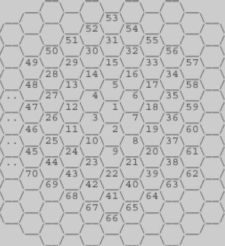

# Bee Hive #

## 1. 문제



- 위의 그림과 같이 육각형으로 이루어진 벌집이 있다.
- 그림에서 보는 바와 같이 중앙의 방 1부터 시작해서 이웃하는 방에 돌아가면서 1씩 증가하는 번호를 주소로 매길 수 있다.
- 숫자 N이 주어졌을 때, 벌집의 중앙 1에서 N번 방까지 최소 개수의 방을 지나서 갈 때 몇 개의 방을 지나가는지(시작과 끝을 포함하여)를 계산하는 프로그램을 작성하시오.
- 예를 들면, 13까지는 3개, 58까지는 5개를 지난다.

## 2. 입력
- 첫째 줄: N (1 ≤ N ≤ 1,000,000)

## 3. 출력

- 입력으로 주어진 방까지 최소 개수의 방을 지나서 갈 때 몇 개의 방을 지나는지 출력한다.  


## 4. 예제 입력
```
13
```

## 5. 예제 출력
```
3
```

## 6. 예제 입력

```
58
```

## 7. 예제 출력

```
5
```

## 8. 코드

```c++
#include <stdio.h>

int main() {
  int num, room = 1, count = 1;
  
  scanf("%d", &num);
  while(true) {
    if (num == 1) break;
    room = room + (6 * count);
    count++;
    
    if(room >= num) break;
  }
  
  printf("%d", count);
  return 0;
}
```
