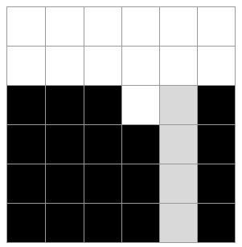

# Tetris

## 1. 문제
- 테트리스를 해본 사람이라면 작대기 모양 테트리미노가 나오길 간절히 기다렸던 적이 있을 것이다.

- 지금 윤성이가 그러하다. 기다리고 기다리던 작대기 모양 테트리미노가 드디어 나온 것이다.

- 테트리스 맵은 가로로 C칸, 세로로 R칸의 C×R격자형 모양이다.

- 예를 들어보자. 아래 그림은 가로가 6칸, 세로가 6칸인 테트리스 맵의 상태이다.

  

- (검정색 칸은 이미 메워져있던 칸이고, 회색칸은 이번에 메울 작대기 모양 테트리미노를 의미한다.)

- 이때 가로가 1칸이고 세로가 4칸인 1×4 직사가형 작대기 모양의 테트리미노(테트리미노는 항상 1×4)를 왼쪽에서 5번째 칸에 둘 경우 총 세줄의 수평선을 메울 수 있다.

- 테트리스는 한번에 여러 수평선을 메울수록 큰 점수를 얻는 게임이므로, 위 경우에서는 이 방법이 가장 높은 점수를 얻을 수 있는 방법이다.

- 윤성이를 도와 작대기 모양 테트리미노를 어디에 두었을 때 가장 높은 점수를 얻을 수 있는지 알려주자.

- (윤성이는 작대기 모양 테트리미노가 나왔을때 게임오버를 당할지언정 가로가 더 길도록 눕혀서 두지 않는다는 나름의 테트리스 철학이 있다.)

- 그리고 테트리스는 무조건 일자로 떨어진다.

- (오른쪽에서 왼쪽으로 공간을 비집고 들어가는 등의 스킬은 윤성이에겐 존재하지않는다.)

## 2. 입력
- 첫 줄: 격자 크기를 나타내는 정수 C와 R이 하나의 공백을 사이에 두고 차례대로 주어진다. ( 5 ≤ C, R ≤ 20 )
- 그다음 줄 부터 총 R줄에 걸쳐 맵의 상태를 나타내는 숫자들이 공백을 사이에 두고 주어진다.
- 0은 아직 채워지지 않은 칸을 나타내며 1은 채워져있는 칸을 나타낸다.

## 3. 출력
- 작대기를 왼쪽에서 X번째 자리에 두었을 때 가장 높은 점수를 얻을 수 있고 그 때 완전히 메워지는 수평선의 개수가 Y개라면, Y를 최대로 만드는 X와 그 때의 Y를 하나의 공백을 사이에 두고 출력해야 한다.
- 만약 어떤 자리에 두어도 수평선을 하나도 메울 수 없거나 게임오버가 일어나는 경우라면 X와 Y를 둘다 0으로 출력한다.
- 게임오버는 새로 내려온 작대기가 맵상을 벗어난 경우에 일어난다. 새로나온 작대기가 맵의 가장자리에 걸쳐있는 경우는 게임오버가 아니다.

## 4. 예제 입력
```
6 7
0 0 0 0 0 0
0 0 0 0 0 0
1 1 1 0 0 1
1 1 1 0 0 1
1 1 1 0 1 1
1 1 1 0 1 1
1 1 1 0 1 1
```

## 5. 예제 출력
```
4 3
```

## 6. 코드
```c++
#include <stdio.h>

int main() {
  int i, j, k, row, c, r, cnt, lineCheck;
  int max = -1, maxIndex, min = 21, minIndex, over = 0;

  scanf("%d %d", &c, &r);
  int tetrisArr[r][c];
  int col[c];
  int check[c];
  
  for(i = 0; i < r; i++) {
    for(j = 0; j < c; j++) {
      scanf("%d", &tetrisArr[i][j]);
      if(i == 0) col[j] = -1;
    }
  }
  
  for(i = 0; i < r; i++) {
    for(j = 0; j < c; j++) {
      if (tetrisArr[i][j] == 1 && col[j] == -1) {
        col[j] = i;
      }
      if (r - 1 == i && tetrisArr[i][j] == 0 && col[j] == -1) {
        col[j] = r;
      }
    }
  }
  
  for(i = 0; i < c; i++) {
    lineCheck = 0;
    for(j = 0; j < r; j++) {
      cnt = 0;
      for(k = 0; k < c; k++) {
        if(col[i] > 3 && col[i] - 4 <= j && col[i] > j && k == i) {
          cnt++;
          continue;
        } 
        if(tetrisArr[j][k] == 1) {
          cnt++;
        }
      }
      if (cnt == c) lineCheck++;
    }
    check[i] = lineCheck;
  }

  for(i = 0; i < c; i++) {
    if (max < check[i]) {
      max = check[i];
      maxIndex = i;
    }
    if (check[i] == 0) over++;
  }
  
  if (over == c || col[maxIndex] == 0) {
    printf("0 0");
  } else {
    printf("%d %d", maxIndex + 1, check[maxIndex]);
  }

  return 0;
}
```
