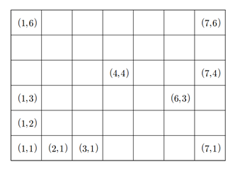

# Seat

## 1. 문제
- 어떤 공연장에는 가로로 C개, 세로로 R개의 좌석이 C×R격자형으로 배치되어 있다.

- 각 좌석의 번호는 해당 격자의 좌표 (x,y)로 표시된다.

- 예를 들어보자.

- 아래 그림은 가로 7개, 세로 6개 좌석으로 구성된 7×6격자형 좌석배치를 보여주고 있다.

- 그림에서 각 단위 사각형은 개별 좌석을 나타내며, 그 안에 표시된 값 (x,y)는 해당 좌석의 번호를 나타낸다.

- 가장 왼쪽 아래의 좌석번호는 (1,1)이며, 가장 오른쪽 위 좌석의 번호는 (7,6)이다.

  

- 이 공연장에 입장하기 위하여 많은 사람이 대기줄에 서있다.

- 기다리고 있는 사람들은 제일 앞에서부터 1, 2, 3, 4, . 순으로 대기번호표를 받았다.

- 우리는 대기번호를 가진 사람들에 대하여 (1,1)위치 좌석부터 시작하여 시계방향으로 돌아가면서 비어있는 좌석에 관객을 순서대로 배정한다.

- 이것을 좀 더 구체적으로 설명하면 다음과 같다.

- 먼저 첫 번째 사람, 즉 대기번호 1인 사람은 자리 (1,1)에 배정한다. 

- 그 다음에는 위쪽 방향의 좌석으로 올라가면서 다음 사람들을 배정한다.

- 만일 더 이상 위쪽 방향으로 빈 좌석이 없으면 오른쪽으로 가면서 배정한다.

- 오른쪽에 더 이상 빈자리가 없으면 아래쪽으로 내려간다.

- 그리고 아래쪽에 더 이상 자리가 없으면 왼쪽으로 가면서 남은 빈 좌석을 배정한다.

- 이 후 왼쪽으로 더 이상의 빈 좌석이 없으면 다시 위쪽으로 배정하고, 이 과정을 모든 좌석이 배정될 때까지 반복한다.

- 아래 그림은 7×6공연장에서 대기번호 1번부터 42번까지의 관객이 좌석에 배정된 결과를 보여주고 있다.

  

- 여러분은 공연장의 크기를 나타내는 자연수 C와 R이 주어져 있을 때, 대기 순서가 K인 관객에게 배정될 좌석 번호 (x,y)를 찾는 프로그램을 작성해야 한다.

## 2. 입력
- 첫째 줄: 공연장의 격자 크기를 나타내는 정수 C와 R이 하나의 공백을 사이에 두고 차례대로 주어진다. (5 ≤ C, R ≤ 1,000) 
- 그 다음 줄에는 어떤 관객의 대기번호 K가 주어진다. (1 ≤ K ≤ 100,000,000)

## 3. 출력
- 입력으로 제시된 대기번호 K인 관객에게 배정될 좌석번호 (x,y)를 구해서 두 값, x와 y를 하나의 공백을 사이에 두고 출력해야 한다. 
- 만일 모든 좌석이 배정되어 해당 대기번호의 관객에게 좌석을 배정할 수 없는 경우에는 0(숫자 영)을 출력해야 한다.

## 4. 예제 입력
```
7 6
12
```

## 5. 예제 출력
```
7 6
```

## 6. 코드
```c++
#include <stdio.h>

int main() {
  int c, r, i, j, x, cnt = 0;
  int minX = 0, minY = 0, maxX, maxY, middleX, middleY;
  int tmpX, tmpY;

  scanf("%d %d", &r, &c);
  scanf("%d", &x);
  int seat[r][c];
  maxX = r; maxY = c;
  middleX = r / 2; middleY = c / 2;
  
  if (x > (r*c) || 5 > c || 5 > r || 1 > x) {
    printf("0");
    return 0;
  }
  
  while(true) {
    
    
    for(i = minY; i < maxY; i++) {
      cnt += 1;
      seat[minX][i] = cnt;
    }
    minX += 1;
    if (minX > middleX) break;
    
    
    for(i = minX; i < maxX; i++) {
      cnt += 1;
      seat[i][maxY - 1] = cnt;
    }
    maxY -= 1;
    if (maxY < middleY) break;
    
    
    for(i = maxY - 1; i >= minY; i--) {
      cnt += 1;
      seat[maxX - 1][i] = cnt;
    }
    maxX -= 1;
    if (maxX < middleX) break;
    
    
    for(i = maxX - 1; i >= minX; i--) {
      cnt += 1;
      seat[i][minY] = cnt;
    }
    minY += 1;
    if (minY > middleY) break;
  }
  
  for(i = 0; i < r; i++) {
    for(j = 0; j < c; j++) {
      if(seat[i][j] == x) {
        tmpX = i; tmpY = j;
        
      }
    }
  }
  
  printf("%d %d", tmpX + 1, tmpY + 1);
  return 0;
}
```
